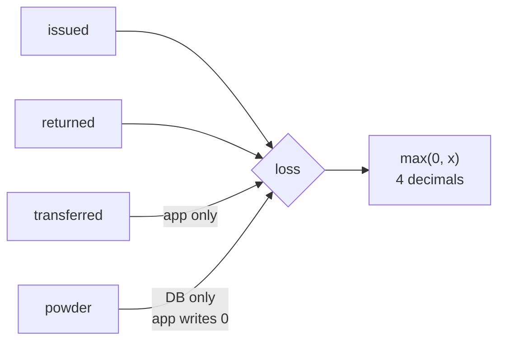
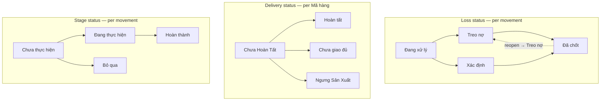

# 01 — Business Rules

> **Generated from source code.** Every formula and threshold below is quoted from the
> implementation with a `file:line` anchor.

---

## Purpose

Be the single authoritative statement of the calculations, status vocabularies, and
enforcement points that govern material tracking — so nobody has to reverse-engineer a
formula from three different call sites again.

## Scope

**In scope:** loss calculation, purity conversion, period derivation, order-code
generation, the three status axes, stage classification, direct-charge gating, weight
warnings, item-vs-header precedence, and draft validation.

**Out of scope:** how the rules are surfaced in UI (`07`), how they persist (`05`, `08`),
and compensation/pricing maths, which **is not implemented** (see `15`).

---

## Current implementation

### Rule 1 — Loss (hao hụt)

The single most important number in the system. **Implemented three times, and the
application and the database do not agree.**

Application (all three sites identical in intent):

```ts
// components/use-material-movements.ts:112
next.loss = Math.max(0, Number((issued - returned - transferred).toFixed(4)));
next.powder = 0;                                    // :113 — powder always zeroed
```

- `lib/production-mappers.ts:331-343` — same formula, used as fallback when `order.loss`
  is not a finite number.
- `components/use-production-orders.ts:491` — same formula again, when recalculating from
  a header edit.

Database — `material_movements.loss_gram` is a **stored generated column**:

```sql
-- supabase/migrations/0001_schema.sql:38-40
loss_gram numeric(14, 4) generated always as (
  greatest(issued_gram - returned_gram - powder_gram, 0)
) stored
```



**Divergence:** the app subtracts `transferred`; the database subtracts `powder` (which the
app always writes as `0`). The app reads the value back from the generated column
(`lib/supabase-mappers.ts:107`), so **for any movement where `transferred > 0`, the number
shown while editing differs from the number stored and re-displayed after save.**
Tracked in `14-known-limitations.md` (L-01).

### Rule 2 — Purity conversion (quy đổi tuổi vàng)

```ts
// lib/production-business-rules.ts:223-225
export function convertToPureGoldWeight(weight: number, purity: number) {
  return Number((weight * (purity || 1)).toFixed(4));
}
```

Applied at `:250-251` as `convertedIssueWeight = convert(issued, goldAge)` and
`convertedReturnWeight = convert(returned, goldAge)`, where `goldAge = Number(order.goldAge || 1)`.
The UI duplicates this arithmetic inline rather than calling the helper.

Source:
- `components/use-material-movements.ts`
- Logic: the inline `weight * (purity || 1)` conversion inside the movement-save handler
  (near `persistMovement`, `:120-121` at time of writing)

Purity values in use (`movementGoldAgeOptions`, `lib/production-journal-options.ts:337-346`):

| Label | `goldAge` |
|---|---|
| 24K | `0.9999` |
| 18K | `0.75` |
| 17K | `0.7083` |
| 16K | `0.6667` |
| 15K | `0.625` |
| 10K | `0.4167` |
| PT | `0.9` |
| BAC | `0.925` |

A second, **conflicting** list also exists (`goldAgeOptions`, `:125-131`) with 23K = `0.9583`
and 15K = `0.61`. It has no importers — dead code, but a trap if reused.

### Rule 3 — Accounting periods

```ts
// lib/production-business-rules.ts:43-45
toMonthCode(date)  // → first 7 chars, "YYYY-MM"
```

- `nxtPeriod` (kỳ nhập-xuất-tồn) = `toMonthCode(occurredDate)` — always the movement's month.
- `lossPeriod` (kỳ tính hao) = existing value, else `getCarryOverLossPeriod(occurredDate, status)`.

```ts
// lib/production-business-rules.ts:95-105 — carry-over logic
if (status is "Đã chốt" | "Xác định" | "Treo nợ")  → current month
else if (day < 28)                                 → current month
else                                               → NEXT month
```

Rationale: a movement recorded in the last days of a month that is still unsettled rolls
into the following settlement period.

### Rule 4 — Production order code

```ts
// lib/production-business-rules.ts:55-67
buildProductionOrderCode(prefix, dateString, existingCodes)
// → `${prefix}-${YY}${MM}${seq}`   e.g. DHAG-26071
```

`seq` = highest existing sequence for that prefix+month, plus one. `buildUniqueProductionOrderCode`
(`:69-71`) is a pure alias with no additional uniqueness logic.
Inverse: `extractOrderCodeMonth` (`:76-83`) — rejects month > 12, assumes century `20xx`.

### Rule 5 — The three status axes

These are **independent** and must never be conflated.



| Axis | Values | Defined at |
|---|---|---|
| Loss status | `Đang xử lý`, `Treo nợ`, `Xác định`, `Đã chốt` | `lib/production-helpers.ts:6` |
| Delivery status | `Chưa Hoàn Tất`, `Hoàn tất`, `Chưa giao đủ`, `Ngưng Sản Xuất` | `lib/production-journal-options.ts:56-61` |
| Stage status | `Chưa thực hiện`, `Đang thực hiện`, `Hoàn thành`, `Bỏ qua` | `lib/production-journal-options.ts:369-374` |

The movement drawer restricts the loss-status picker to only `Treo nợ` / `Xác định`
(`movementLossStatusOptions`, `:332-335`).

**Closed = `Đã chốt` only:**
```ts
// lib/production-helpers.ts:70-72
export function isClosedStatus(status: Status) { return status === "Đã chốt"; }
```

Summary status roll-up for orders with no header (`getSummaryStatus`, `:63-68`), by priority:
`Treo nợ` > `Đang xử lý` > (all closed → `Đã chốt`) > `Xác định`.

### Rule 6 — Stage model

Twelve **main journal stages**, in process order (`mainJournalStageCodes`,
`lib/production-journal-options.ts:71-74`):

`NAU → CKE → DAN → KBI → QBI → DAP → NEN → DKB → BAO → GEP → BAS → SXK`

A wider catalog of **31 stage codes** exists (`journalStages`, `:76-108`) including
sub-stages (KHO, XMA, HAN, NPK, …) used for labelling but not shown as journal tabs.

**Single-worker stages** — at most one worker record per stage per item:
```ts
// lib/production-business-rules.ts:209
export const SINGLE_WORKER_STAGE_CODES = ["CKE", "DAN", "KBI"];
```
All other stages are multi-worker. Saving into a single-worker stage that already has a
record silently converts the insert into an update.

Source:
- `components/use-material-movements.ts`
- Logic: `existingStageMovement` / `effectiveEditingId` resolution inside `persistMovement`
  (`:155-172` at time of writing)

`normalizeStageCode` (`:107-163`) maps ~34 Vietnamese spellings (with and without
diacritics) to codes; **unknown input passes through unchanged**.
`getStageLabel` (`:165-201`) maps code → full name, falling back to the code.

### Rule 7 — Loss-attribution rule per stage (`HaoHutRule`)

```ts
// lib/production-business-rules.ts:3-9
type HaoHutRule = "truc_tiep" | "kiem_soat_rui_ro" | "binh_thuong";
// defaults: CKE = truc_tiep, DAN = truc_tiep, BAO = kiem_soat_rui_ro, rest = binh_thuong
```
DB values in `production_stages.hao_hut_rule` override the defaults (`resolveStageRule`, `:11-13`).

It gates exactly two behaviors:

1. **Direct-charge gate** — `shouldForceDirectCharge` (`:215-217`): status `Xác định` is
   **blocked** unless the stage's rule is `truc_tiep`. Enforced as a hard save-blocker.

   Source:
   - `components/use-material-movements.ts`
   - Function: `persistMovement`
   - Logic: the `shouldForceDirectCharge` guard that sets `remoteError` and aborts the save
     (`:142-147` at time of writing)
2. **Worker inventory risk label** — `getWorkerInventoryRiskStatus` (`:227-232`):
   `|diff| < 5g` → `An toàn`; else `kiem_soat_rui_ro` → `Đang kiểm soát`; else → `Rủi ro`.

### Rule 8 — Large weight warning

```ts
// lib/production-business-rules.ts:219-221
isLargeWeightMovement = max(issued, returned, transferred) > 2000   // grams
```
Produces an audit warning only — it never blocks a save.

Source:
- `components/use-material-movements.ts`
- Function: `persistMovement`
- Logic: the `isLargeWeightMovement` warning push (`:149-151` at time of writing)

### Rule 9 — Item-level status with header fallback

One LSX may contain several Mã hàng, each closing independently. Resolution order:

```ts
// lib/production-summary.ts:122
status: item.status || header.status
// lib/production-summary.ts:88
deliveryStatus: pickText(item.deliveryStatus, header.deliveryStatus)
```

The fallback exists so records created before migrations `0024` / `0026` (which added the
per-item columns) still resolve. Same item→header precedence applies to `qtyPiece`,
`deliveredQty`, `completedWeightGram`, `plannedMaterial`, `materialSpec`, `plannedGoldAge`,
`plannedMaterialType`, `productName`.

### Rule 10 — Draft validation

Source:
- `lib/production-helpers.ts`
- Function: `validateMovementDraft`

Eight required fields, checked by `.trim()` truthiness only:
`code` (Mã LSX), `sku` (Mã hàng), `occurredDate` (Ngày nghiệp vụ), `destination` (Nơi nhận),
`stage` (Công đoạn), `worker` (Thợ phụ trách), `stageStatus`, `status` (Trạng thái tính hao).

**Numeric validation:** `issued` (label `"Xuất"`), `returned` (label `"Nhập"`), `transferred`
(label `"Chuyển"`), and `goldAge` (label `"Tuổi vàng"`) are each rejected if `NaN`,
`Infinity`, `-Infinity`, or negative (helper `isInvalidNumeric` in the same file, built on
`Number.isFinite`). `transferred` and `goldAge` are optional fields — `undefined`/`null` is
**not** treated as invalid for either.

**Explicitly still allowed, unchanged:**
- Zero is a valid value for `issued`, `returned`, `transferred`, and `goldAge` — this is the
  default state produced by `createEmptyOrder()` (`lib/production-mappers.ts`) for a new
  `Treo nợ` draft, and remains saveable.
- `goldAge = 0` still falls through to the existing `Number(order.goldAge || 1)` fallback in
  `lib/production-business-rules.ts` — unaffected by this validation.
- `returned > issued` is **not** checked — no comparison between the two fields exists.
- `powder` is **not** validated — it is always force-set to `0` before save
  (`components/use-material-movements.ts`) and is never user-editable.

See `tasks/backlog/003-high-priority.md` for the deferred decisions (exact `returned > issued`
tolerance, whether zero quantities or `goldAge = 0` should ever be rejected, and whether
`Treo nợ` needs special numeric rules) that were intentionally left out of this validation.

---

## Important rules

1. **Never re-implement the loss formula.** It already exists in three places; adding a
   fourth deepens the problem. Any change must reconcile app and DB together (L-01).
2. **`Xác định` is only legal on `truc_tiep` stages.** This is a hard blocker, not a warning.
3. **`powder` is always `0` in application writes.** Do not add a UI field for it without
   resolving Rule 1 first.
4. **Weights are 4-decimal.** All rounding uses `.toFixed(4)`.
5. **`Status` is typed `string`, not a union** (`lib/domain/production.ts:3`) — the compiler
   will not catch a typo in a status literal. Compare against the exported option arrays.
6. **Item status wins over header status.** Never read `header.status` directly for display.

## Related source code

| File | Role |
|---|---|
| `lib/production-business-rules.ts` (253) | pure rules: codes, periods, purity, stages, gates |
| `lib/production-helpers.ts` (72) | status vocabulary, `isClosedStatus`, validation, formatters |
| `lib/production-journal-options.ts` (374) | every dropdown vocabulary + stage catalog |
| `lib/production-summary.ts` (367) | aggregation, item→header fallback |
| `components/use-material-movements.ts` (455) | where rules are enforced on save |
| `lib/production-mappers.ts` (357) | fallback recomputation during row merge |

## Related database

- `material_movements.loss_gram` — generated column, the authoritative stored loss.
- `material_movements.gold_age`, `converted_issue_weight`, `converted_return_weight`.
- `material_movements.loss_period`, `nxt_period`.
- `production_stages.hao_hut_rule` — per-stage override of the attribution rule.
- `production_order_items.status`, `.delivery_status` — per-item state (migrations `0024`, `0026`).

## Known limitations

- **L-01** app/DB loss divergence (above) — highest-severity known issue.
- Rule 1's formula has three implementations; they can drift independently.
- Two contradicting purity tables exist; the unused one is wrong.
- No numeric validation at all in `validateMovementDraft`.
- `Status = string` gives no compile-time safety.
- Compensation/settlement maths (loss-vs-norm, VND amounts) is **entirely absent** despite
  being central to the business problem.
- Closing an LSX does **not** block adding new movements to it — only editing and deleting
  are guarded. See `14-known-limitations.md` (L-09).

## Future improvements

1. Reconcile loss into **one** implementation and make app and DB agree (decide whether
   `transferred` or `powder` is correct with the accounting team).
2. Convert `Status` to a real union type and derive the option arrays from it.
3. Add numeric guards to `validateMovementDraft` (non-negative, `returned <= issued + tolerance`,
   `goldAge > 0`).
4. Delete the unused `goldAgeOptions` table to remove the ambiguity.
5. Introduce loss-norm and compensation calculation (`loss_norms`, `loss_settlements`
   tables already exist unused — see `05-database.md`).
