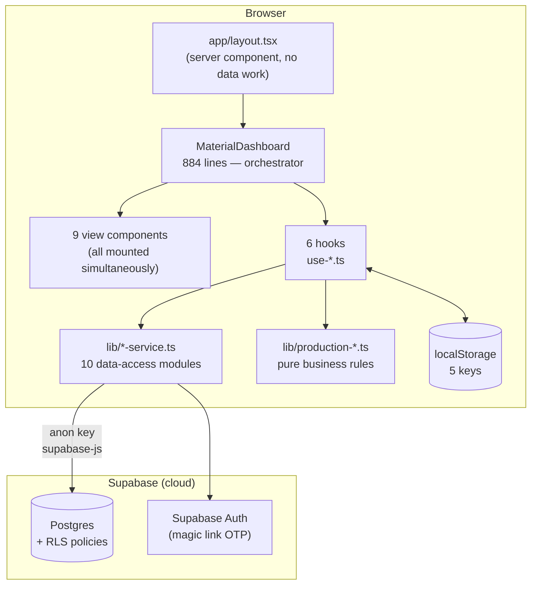
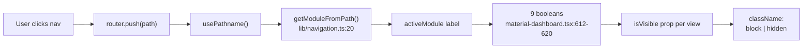
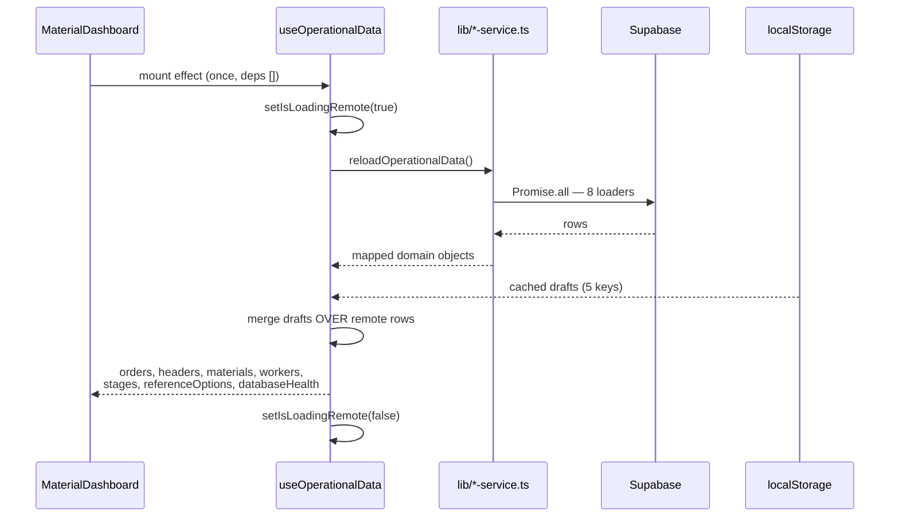
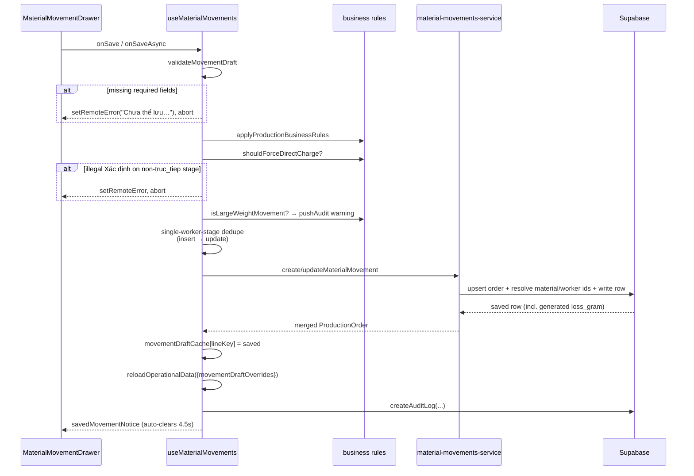
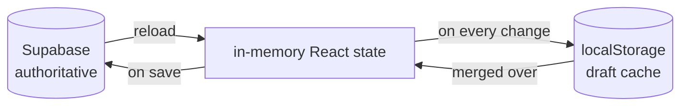

# 02 — Current Architecture

> **Generated from source code.** The absence of a backend was verified by exhaustive
> search, not assumed: no `app/api` directory, no `route.ts`/`route.tsx` anywhere, no
> `"use server"`, no `getServerSideProps`/`getStaticProps`.

---

## Purpose

Explain how the application is actually wired end to end, so that changes are made in the
right layer and the two non-obvious mechanisms (single-mount routing, draft-over-remote
persistence) are not accidentally broken.

## Scope

**In scope:** runtime topology, layer responsibilities, the routing/mounting model, read
and write data flow, the three-tier persistence model, and error/loading propagation.

**Out of scope:** per-module UI behavior (`07`), service signatures (`08`), schema (`05`).

---

## Current implementation

### Topology — a client SPA speaking directly to Supabase



**There is no application server.** Vercel serves static assets and the React bundle;
every read and write is a direct browser→Supabase call authenticated by the user's session
JWT. Authorization is enforced by Postgres RLS. See `06-authentication.md`.

### Layer responsibilities

| Layer | Location | May depend on | Must not |
|---|---|---|---|
| Routes | `app/**/page.tsx` | nothing | contain UI or fetch data |
| Shell | `app/layout.tsx` | `AuthProvider`, `AuthGate`, `MaterialDashboard` | fetch data |
| Orchestrator | `components/material-dashboard.tsx` | hooks, views, lib | talk to Supabase directly |
| Views | `components/*-view.tsx`, `*-drawer.tsx`, `*-overlay.tsx` | props, `production-ui`, lib (pure) | own remote state |
| Hooks | `components/use-*.ts` | services, lib | render JSX |
| Services | `lib/*-service.ts` | `lib/supabase.ts`, mappers, types | import React or components |
| Business rules | `lib/production-*.ts`, `lib/domain/`, `lib/use-cases/` | types only | import React, Supabase, or services |

`lib/production-business-rules.ts`, `production-summary.ts`, and `production-workflow.ts`
are **pure and framework-free** — which is exactly why they are the only files with tests.

### The routing model — every page is a stub

All nine `page.tsx` files are literally three lines:

```tsx
export default function Page() {
  return null;
}
```

The whole application is mounted **once** in the root layout and never unmounts on
navigation (`app/layout.tsx:15-31`):

```tsx
export const dynamic = "force-dynamic";
// ...
<AuthProvider>
  <AuthGate>
    <Suspense fallback={null}>
      <MaterialDashboard />
    </Suspense>
  </AuthGate>
</AuthProvider>
{children}   {/* children is the null page */}
```

A route therefore only supplies a **pathname string**, which is translated into a module label:



**Consequence to understand before optimizing anything:** all nine modules stay mounted, so
every module's `useMemo` chain re-evaluates on every render regardless of the active route.
This is a known performance limitation (`14-known-limitations.md`, L-07), not a bug to
"fix" casually — the pattern is what preserves in-progress form state across navigation.

### Read path



`reloadOperationalData` (`components/use-operational-data.ts:88-165`) does, in order:

1. `Promise.all` of eight loaders — `loadProductionOrders`, `loadProductionOrderHeaders`,
   `loadProductionOrderItems`, `loadMaterials`, `loadWorkers`, `loadStages`,
   `loadReferenceOptions`, `loadDatabaseHealth`.
2. Groups items by `orderCode` and attaches them to their header (`:112-117`).
3. Merges header drafts, then movement drafts, over the remote rows (`:119-132`).
4. Back-fills a movement's `code`/`sku`/`productName`/… from its header when the movement
   has an `orderId` but no `code` (`:136-150`).
5. Seven `setState` calls (`setOrders`, `setProductionHeaders`, `setMaterials`, `setWorkers`,
   `setStages`, `setReferenceOptions`, `setDatabaseHealth`); returns
   `{ remoteMaterials, remoteWorkers }` so the caller can seed default form values.

If Supabase is unconfigured it returns immediately (`:89`) and a separate effect fabricates
local master data plus `databaseHealth.usingRealSupabase = false` (`:167-193`).

### Write path — movement save



Core function: `persistMovement` (`components/use-material-movements.ts:131-223`).

Note step "reloadOperationalData({movementDraftOverrides})": the override parameter exists
because the hook's closure captures a **stale** draft cache. Callers that just wrote a
draft must pass the fresh object, or the reload will clobber it. This is subtle and easy
to break.

### Three-tier persistence



Five `localStorage` keys (`components/use-local-storage-persistence.ts:8-12`):

| Key | Holds |
|---|---|
| `qlkt-k2-material-orders` | movement rows (demo/offline mode) |
| `qlkt-k2-production-order-headers` | LSX headers (demo/offline mode) |
| `qlkt-k2-audit-events` | local audit trail |
| `qlkt-k2-movement-draft-cache` | unsaved movement drafts, keyed by `code::itemSku` |
| `qlkt-k2-production-header-draft-cache` | unsaved LSX drafts, keyed by `code` |

One mount effect reads all five with per-key `try/catch`; five write effects each guarded
by `if (!hasLoadedStorage) return` (`:103-126`) — that guard is what stops empty initial
state from overwriting real saved data on first paint.

### Cross-cutting state

- **Loading:** a single `isLoadingRemote` boolean → the text "Đang tải dữ liệu..." in the
  sidebar (`components/app-shell.tsx:101`). No skeletons.
- **Errors:** a single `remoteError: string | null` → a fixed top-right dismissible card
  (`app-shell.tsx:56-74`). This channel is **also** used for client-side validation
  messages, so field errors appear as a global toast rather than inline.
- **Success:** `savedMovementNotice`, auto-cleared after `4500 ms`
  (`use-material-movements.ts:30`).

---

## Important rules

1. **Do not add UI or data fetching to `app/**/page.tsx`.** They must stay `return null`.
2. **Do not introduce API routes, route handlers, or server actions** without an explicit
   architecture decision — the anon-key + RLS model assumes the client is the only caller.
3. **Business logic belongs in `lib/`, not in components or hooks.** Pure functions there
   are the only testable surface.
4. **Services must never import React or components**; business-rule modules must never
   import Supabase.
5. **When you write a draft then reload, pass the `*Overrides` argument.** Omitting it
   reintroduces the stale-cache bug.
6. **Preserve the `hasLoadedStorage` guard.** Removing it wipes user data on first render.

## Related source code

| File | Lines | Role |
|---|---|---|
| `app/layout.tsx` | 32 | the only mount point |
| `lib/navigation.ts` | 25 | module ↔ route mapping |
| `components/material-dashboard.tsx` | 884 | orchestrator, owns nearly all state |
| `components/app-shell.tsx` | 133 | nav, header, global error/loading |
| `components/use-operational-data.ts` | 218 | the only bulk remote reader |
| `components/use-material-movements.ts` | 455 | movement write path |
| `components/use-local-storage-persistence.ts` | 129 | draft/offline cache |
| `lib/supabase.ts` | 10 | client + `isSupabaseConfigured` |

## Related database

Reads touch `production_orders`, `production_order_items`, `material_movements`,
`materials`, `workers`, `production_stages`, `reference_options` (plus counts for
`audit_logs`). Writes touch the same set plus `audit_logs` and `app_users`.
Full detail in `05-database.md`.

## Known limitations

- All nine modules render on every route → wasted computation (L-07).
- `material-dashboard.tsx` is a 884-line god component holding logic that belongs in hooks
  or `lib/` (`recordStageEntry`, `pushAudit`, `exportJson`, `getDynamicOptions`).
- The mount effect has an empty dependency array — data loads exactly **once** per session;
  there is no polling, revalidation, or realtime subscription.
- `remoteError` conflates transport failures with form validation.
- No optimistic-concurrency control: two users editing the same movement silently
  last-write-wins.
- `hasLoadedStorage` is set from two different places, which is fragile.

## Future improvements

1. Split `material-dashboard.tsx` — extract `recordStageEntry` into `use-material-movements`,
   move mapper helpers into `lib/production-mappers.ts`.
2. Render only the active module (keep drafts in the existing cache rather than relying on
   permanently-mounted components) to cut render cost.
3. Separate a `validationError` channel from `remoteError` and show field-level messages.
4. Consider Supabase realtime or an explicit refresh action instead of load-once.
5. Add `updated_at` + conflict detection on `material_movements` for concurrent edits.
