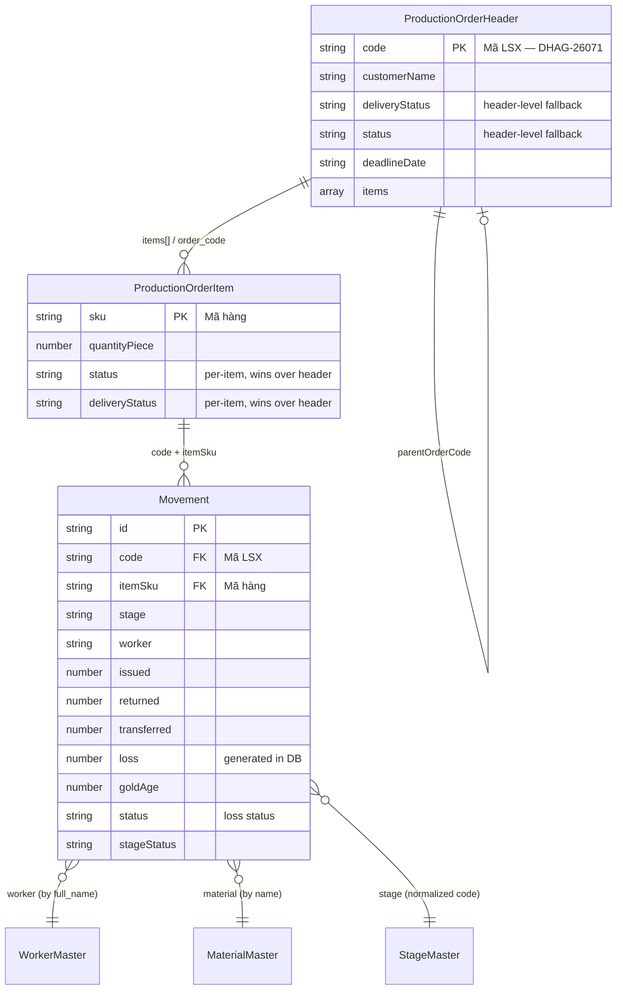
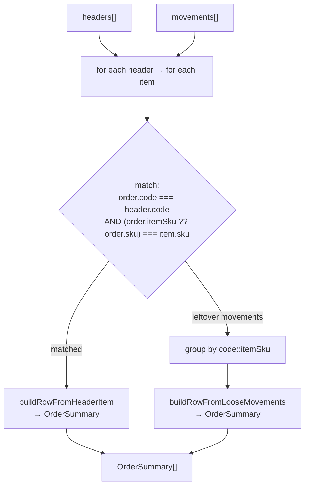

# 04 — Domain Model

> **Generated from source code.** Types quoted from `lib/domain/production.ts`,
> `lib/production-types.ts`, `lib/material-service-types.ts`.

---

## Purpose

Define the entities the business reasons about, their relationships, and — critically — the
places where a type's **name does not match what it holds**, which is the most common source
of confusion in this codebase.

## Scope

**In scope:** core entities, aggregation/view types, master data, relationships, key
resolution, and the naming traps.

**Out of scope:** physical columns (`05-database.md`), formulas (`01-business-rules.md`).

---

## Current implementation

### The central hierarchy



### ⚠ Naming trap: `ProductionOrder` is **not** a production order

```ts
// lib/domain/production.ts:5-48
export type ProductionOrder = { … 43 fields … };
```

Despite the name, **`ProductionOrder` represents a single material-movement line** — one
worker, at one stage, for one item, on one date. The actual production order (LSX) is
`ProductionOrderHeader`. In this document and in `mermaid` diagrams the movement entity is
labelled `Movement` for clarity, but **the TypeScript name is `ProductionOrder`** and it is
used throughout the codebase (including as the element type of the `orders` state array).

Read `orders: ProductionOrder[]` as "the journal of movements", not "the list of orders".

### Core entity: `ProductionOrder` (= movement)

Fields group into six clusters (`lib/domain/production.ts:5-48`):

| Cluster | Fields |
|---|---|
| Identity | `id`, `orderId`, `code` (Mã LSX), `sku`, `itemSku`, `productName` |
| Context | `material`, `worker`, `stage`, `stageStatus`, `destination`, `occurredDate` |
| Documents | `documentNo`, `documentInNo`, `documentLineNo`, `movementType`, `qtyPiece` |
| Issue block | `issueDate`, `issueSku`, `issueProductName`, `issueQtyPiece` |
| Return block | `returnDate`, `returnSku`, `returnProductName`, `returnQtyPiece` |
| Weights | `issued`, `returned`, `powder`, `transferred`, `loss`, `convertedIssueWeight`, `convertedReturnWeight`, `goldAge` |
| Periods / NXT | `lossPeriod`, `nxtPeriod`, `sourceMaterialName`, `nxtLinkCode`, `sourceName`, `importSource`, `exportSource`, `materialType` |
| State | `status` |

The separate **issue** and **return** blocks (added by migration `0025`) exist because a
worker may return a *different* product code than was issued (e.g. after joining or cutting).

`MovementType` (`:1`) = `"issue" | "return" | "transfer" | "adjustment"`.

### Loss status is a union; stage/delivery status are not

```ts
// lib/domain/production.ts
export const LOSS_STATUSES = ["Đang xử lý", "Treo nợ", "Xác định", "Đã chốt"] as const;
export type LossStatus = (typeof LOSS_STATUSES)[number];

/** @deprecated Use `LossStatus`. */
export type Status = LossStatus;
```

`LOSS_STATUSES` is the single source of truth for the loss-status vocabulary — `statusOptions`
(`lib/production-helpers.ts`) is derived from it, so the type and the dropdown cannot drift, and
a mistyped loss-status literal is a compile error. `Status` remains only as a temporary
deprecated alias while the remaining importers migrate.

**⚠ `stageStatus` and `deliveryStatus` are still typed `string`.** Both are persisted raw
(no translation layer, no CHECK constraint on the column), so the live database may hold values
outside their documented four-value option lists. Narrowing them is deferred until those
vocabularies are verified against real data — see `tasks/backlog/008-low-priority.md`. For those
two fields, always compare against the exported option arrays; never invent a literal.

### `ProductionOrderHeader` — the LSX

`lib/production-types.ts:70-121`. All fields non-optional. Holds order-level facts
(`customerName`, `salesType`, `destination`, `deadlineDate`, `plannedDate`, `specification`,
`actualProgressNote`, …) plus `items: ProductionOrderItem[]`.

For backward compatibility it **also duplicates the primary item's** `sku`, `productName`,
`plannedMaterial`, `materialSpec`, etc. (comment at `:117-119`). Prefer reading from `items`.

`parentOrderCode` (migration `0021`) links an order created via "tạo đơn mới cho khách này"
back to its origin, used only to display a same-customer hint.

### `ProductionOrderItem` — the Mã hàng

`lib/material-service-types.ts:110-131`. One product code within an LSX, with its own
quantity, planned material, weights, **and its own `status` and `deliveryStatus`** so that
items close independently:

```ts
status?: Status;          // :126  — migration 0024
deliveryStatus?: string;  // :130  — migration 0026
```

### `OrderSummary` — the display row

`lib/production-types.ts:14-68`. **One row = one LSX code + one item SKU**, with all matching
movements rolled up. This is what every table and filter actually consumes.

Produced by `buildOrderSummaries(orders, headers)` (`lib/production-summary.ts:196-226`):



"Loose" movements are journal entries written **before** their LSX existed — a real workflow
the system supports, not an error state.

Adds over the header/item fields: `movementCount`, summed `issued`/`returned`/`powder`/`loss`,
`issuedDefault`/`returnedDefault`/`powderDefault` (header defaults for pre-filling forms),
`workers[]`, `materials[]`, `headerStatus`.

### Row identity

```ts
// lib/production-summary.ts:14-20
orderLineKey(code, sku) → `${code}::${sku?.trim() || "-"}`
orderRowKey(summary)    → orderLineKey(summary.code, summary.sku)
```

**A bare `code` is not a unique key** — an LSX with three Mã hàng produces three rows. Always
key on `code + sku`.

### Derived / reporting types

| Type | File:line | Meaning |
|---|---|---|
| `LossReportRow` | `production-summary.ts:284-295` | loss aggregated by stage+worker+material+status **across the whole period** (not per LSX) |
| `StageProgressItem` | `production-summary.ts:340-349` | per-stage totals + `isCurrent` flag |
| `StageWorkerAggregate` | `production-workflow.ts:169-174` | `workerCount` + totals for one stage of one LSX+item |
| `ProductionOverview` | `production-workflow.ts:42` | dashboard counters: `total`, `noMovementCount`, `overdueCount`, `inProgressCount` |
| `SelectedOrderDetail` | `production-workflow.ts:49` | flattened detail for the LSX drawer |
| `WorkerBoxBalanceLine` | `worker-box-data.ts:1-49` | one worker/stage/metal/period balance line |
| `StageOption` | `production-summary.ts:249` | `{ value, label }` dropdown entry |
| `AuditEvent` | `production-types.ts:7-12` | `action`, `detail`, `createdAt` |

**Resolution precedence in `buildSelectedOrderDetail`** (`production-workflow.ts:248-291`):
latest movement → summary → matching item (by `sku`) → header. So operational facts
(current stage, worker, material) reflect reality; planning facts fall back to the order.

### Master data

| Type | File:line | Notes |
|---|---|---|
| `MaterialMaster` | `material-service-types.ts:6` | `code`, `name`, `category`, `purity`, `unit` |
| `WorkerMaster` | `:15` | `worker_code`, `full_name`, `department`, **`stages: string[]`** (many stages per worker, migration `0014`) |
| `StageMaster` | `:26` | `stage_code`, `stage_name`, `hao_hut_rule` |
| `ReferenceOption` | `:33` | `list_key` + `option_code` + `option_label` — generic dropdown source |
| `DatabaseHealth` | `:41` | row counts + `usingRealSupabase` |
| `AppUser` | `auth-service.ts:3` | `email`, `full_name`, `role: "admin" \| "nhan_vien"` |

Movements reference master data **by display value, not by id** — `worker` is a `full_name`
string, `material` is a `name` string. The service resolves these to UUIDs at save time
(`material-movements-service.ts:190-231`), creating the worker if missing.

---

## Important rules

1. **`ProductionOrder` = a movement line.** Never assume it is an LSX.
2. **Key rows by `code + sku`** (`orderRowKey`), never by `code` alone.
3. **Read status from the item, with header fallback** — `item.status || header.status`.
   Never render `header.status` directly.
4. **Prefer `header.items` over the duplicated primary-item fields** on the header.
5. **`Status` is `string`** — compare against exported option arrays.
6. **Reporting aggregates come from movements, never from headers.** `buildLossReportRows`
   and `buildWorkerBoxLinesFromMovements` both take `orders` (movements) as input; keep it
   that way, or reports will silently double-count planned-but-unrecorded work.
7. **`nxtLinkCode` is a material-group code, not a stage link.** It encodes
   `{NL|BOT|VAYHAN|PK|BTPBI|BTPDAY|TP} × metal` (`production-journal-options.ts:137-215`).
   No logic chains stages through it.

## Related source code

| File | Contents |
|---|---|
| `lib/domain/production.ts` (48) | `ProductionOrder`, `Status`, `MovementType` |
| `lib/production-types.ts` (139) | `ProductionOrderHeader`, `OrderSummary`, `AuditEvent`, `PendingJournalRow` |
| `lib/material-service-types.ts` (137) | items, master data, DB record shapes |
| `lib/production-summary.ts` (367) | header/item/movement → `OrderSummary`; report rows |
| `lib/production-workflow.ts` (291) | filters, overview, detail flattening |
| `lib/worker-box-data.ts` (350) | `WorkerBoxBalanceLine` + fixtures |

## Related database

| Domain type | Table |
|---|---|
| `ProductionOrder` (movement) | `material_movements` |
| `ProductionOrderHeader` | `production_orders` |
| `ProductionOrderItem` | `production_order_items` |
| `MaterialMaster` | `materials` |
| `WorkerMaster` | `workers` |
| `StageMaster` | `production_stages` |
| `ReferenceOption` | `reference_options` |
| `AppUser` | `app_users` |
| `AuditEvent` | `audit_logs` (write-only from the UI) |
| `OrderSummary`, `LossReportRow`, `StageProgressItem`, `WorkerBoxBalanceLine` | **none — computed in the browser** |

Row↔domain conversion: `lib/supabase-mappers.ts` (121 lines), including
`toDbStatus`/`fromDbStatus` for the snake_case ↔ Vietnamese status mapping.

## Known limitations

- `ProductionOrder` is misnamed; renaming it is a large but valuable refactor.
- `stageStatus` / `deliveryStatus` provide no type safety (still `string`); loss status is now
  the `LossStatus` union. The deprecated `Status` alias is still exported.
- `ProductionOrderHeader` duplicates primary-item fields, so two sources of truth exist for
  `sku`/`productName` on a single-item LSX.
- Movements bind to master data by **display name**, so renaming a worker or material
  orphans historical rows.
- `PendingJournalRow` (`production-types.ts:123-139`) is exported but unreferenced.
- `WorkerBoxBalanceLine` has no table behind it — the type is real, the data is fixtures.
- No domain-level `updated_at`/version field, so concurrent edits cannot be detected.

## Future improvements

1. Rename `ProductionOrder` → `MaterialMovement` (and `orders` → `movements`) in one
   mechanical pass; this removes the single biggest comprehension barrier.
2. ~~Make loss `Status` a union and derive `statusOptions` from it~~ **done** (`LossStatus`).
   Remaining: `stageStatus` / `deliveryStatus` unions, pending live-data verification.
3. Reference master data by id on movements, keeping display names denormalized for history.
4. Drop the duplicated primary-item fields from `ProductionOrderHeader`.
5. Delete `PendingJournalRow` if it is genuinely unused.
