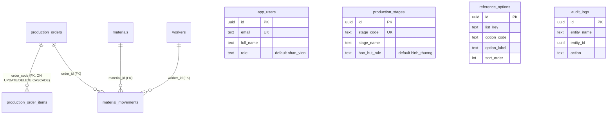
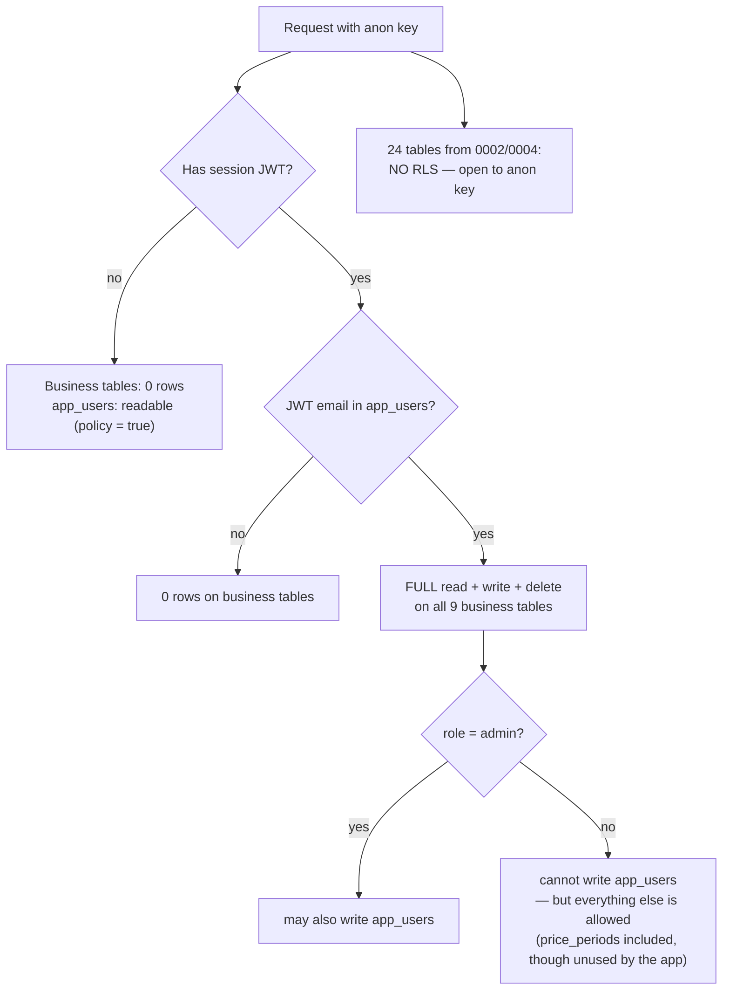

# 05 — Database

> **Generated from source code.** The schema below is the *effective* result of applying
> migrations `0001`→`0026` in order, including reverts. Verified against the SQL, then
> cross-checked against every `.from("…")` call in `lib/`.

---

## Purpose

Give the true current shape of the database: which tables are real and used, which exist but
are dead, what RLS actually enforces, and how migrations are applied.

## Scope

**In scope:** effective schema of live tables, dead schema inventory, RLS policies, indexes,
migration history, the generated-column behavior, and the manual migration procedure.

**Out of scope:** domain types (`04`), auth flow (`06`), service functions (`08`).

---

## Current implementation

### Live tables — the nine actually queried

Only these appear as `.from("…")` targets anywhere in `lib/*-service.ts`:



#### `production_orders` — LSX header
Base from `0001`, heavily extended by `0003`, plus `parent_order_code` (`0021`).
Key columns: `order_code` (unique, the business key), `sku`, `product_name`, `destination`,
`order_date`, `occurred_date`, `document_no`, `document_in_no`, `document_line_no`,
`movement_type`, `quantity_piece`, `planned_date`, `planned_stage`, `planned_worker`,
`planned_material`, `material_spec`, `planned_gold_age`, `planned_material_type`,
`delivery_status`, `order_month`, `sales_type`, `customer_name`, `specification`,
`deadline_date`, `completed_date`, `delivered_qty`, `actual_progress_note`,
`completed_weight_gram`, `issued_gram`, `returned_gram`, `powder_gram`,
`transferred_weight_gram`, `loss_period`, `nxt_period`, `source_material_name`,
`source_name`, `import_source`, `export_source`, `nxt_link_code`, `converted_issue_weight`,
`converted_return_weight`, `note`, `status` (default `dang_xu_ly`), `parent_order_code`.

> `product_qty` **does not exist** — added by `0019`, dropped by `0020`.

#### `material_movements` — the journal (operational core)
Base `0001`, extended by `0002`, `0003`, `0022` (`item_sku`), `0025` (issue/return blocks).

**`loss_gram` is a stored generated column** — you cannot write to it:

```sql
-- 0001_schema.sql:38-40
loss_gram numeric(14, 4) generated always as (
  greatest(issued_gram - returned_gram - powder_gram, 0)
) stored
```

The application never writes it and always reads it back
(`lib/supabase-mappers.ts:107`). **The application's own loss formula subtracts
`transferred`, not `powder`** — see `01-business-rules.md` Rule 1 and limitation L-01.

Other notable columns: `order_id`/`material_id`/`worker_id` (FK, all `not null`),
`process_name` (the stage, stored as a **label** not a code), `issued_gram`,
`returned_gram`, `powder_gram`, `transferred_weight_gram`, `status`, `occurred_date`,
`item_sku`, `stage_status`, `gold_age`, `converted_issue_weight`,
`converted_return_weight`, `loss_period`, `nxt_period`, `material_type`, `nxt_link_code`,
`import_source`, `export_source`, `source_name`, `source_material_name`, `qty_piece`,
plus `issue_date`/`issue_sku`/`issue_product_name`/`issue_qty_piece` and the four
`return_*` equivalents.

#### `production_order_items` — Mã hàng lines
Added `0022`; `planned_weight_gram` (`0023`), `status` (`0024`), `delivery_status` (`0026`).
`unique(order_code, sku)`; FK to `production_orders(order_code)` with
`on update cascade on delete cascade`.

#### Master data
- `materials` — `code` (unique), `name`, `category`, `purity numeric(8,4)`, `unit`.
- `workers` — `worker_code` (unique), `full_name`, `department`, **`stages text[]`**
  (`0014`, many stages per worker), plus a legacy nullable `stage` column the app no longer uses.
- `production_stages` — `stage_code` (unique), `stage_name`, `hao_hut_rule`. Final data is
  the full **31-code** catalog (`0016` pruned it to 12; `0017` restored it).
- `reference_options` — `unique(list_key, option_code)`; `nguon_nvl` holds ~74 NXT codes (`0013`).
- `app_users` — email whitelist + role.
- `audit_logs` — insert-only from the app.
- `price_periods` — exists, extended by `0002`, has RLS enabled (`0010`), but **never
  targeted by a `.from("price_periods")` call anywhere in `lib/`** — not a live table
  despite being schema-complete and protected.

### Dead schema — created but never queried

Roughly **24 tables** exist in migrations with no code reference at all:

| Migration | Tables |
|---|---|
| `0002` | `process_stages`, `customers`, `stores`, `products`, `sales_orders`, `sales_order_items`, `production_tasks`, `material_requests`, `material_purchase_transactions`, `worker_box_balances`, `inventory_period_balances`, `loss_norms`, `loss_settlements`, `refining_batches` |
| `0004` | `worker_box_periods`, `worker_box_import_batches`, `worker_box_raw_rows`, `worker_box_balance_lines`, `worker_box_balance_metrics`, `worker_box_source_movements`, `worker_box_reconciliation_logs` |

Notably, `0004` built a complete worker-box ingestion schema, but **`lib/worker-box-service.ts`
and `components/worker-box-view.tsx` never touch Supabase** — the Tồn hộp thợ module computes
everything in the browser from movements plus `lib/worker-box-data.ts` fixtures.

Dead **columns** on live tables: `material_movements.finished_weight_gram`,
`export_plating_weight_gram`, `sales_order_id`, `product_id`, `stage_id` (indexed but never
written), `occurred_at`; `production_orders.sales_order_id`, `product_id`,
`planned_start_date`, `planned_end_date`, `actual_start_date`, `actual_end_date`,
`locked_at`, `reopen_reason`; `workers.stage`; all `price_periods` extended columns.

### Row Level Security

RLS is enabled on exactly **ten** tables: `app_users` (`0009`), the eight looped in `0010`
(`materials`, `workers`, `production_orders`, `material_movements`, `price_periods`,
`audit_logs`, `production_stages`, `reference_options`), and `production_order_items` (`0022`).
Note that `price_periods` is protected by RLS but is not one of the nine tables the
application actually queries — see "Live tables" above.

```sql
-- 0010: per business table
create policy "<tbl>_whitelisted_access" on <tbl>
  for all using (is_whitelisted_user()) with check (is_whitelisted_user());

-- is_whitelisted_user()
exists (select 1 from app_users where email = auth.jwt() ->> 'email')

-- 0009 / 0011: app_users
create policy app_users_select_all   on app_users for select using (true);
create policy app_users_admin_write  on app_users for all
  using (is_admin_user()) with check (is_admin_user());   -- SECURITY DEFINER, fixes 0011 recursion
```



Two facts that matter:

1. **RLS is a binary whitelist, not role-based.** Any whitelisted user — `admin` or
   `nhan_vien` — has full read/write/delete on every business and master-data table. Role
   affects only `app_users` writes at the DB level.
2. **The ~24 tables from `0002`/`0004` have no RLS at all**, so anyone holding the public
   anon key can read and write them. See `14-known-limitations.md` (L-03).

### Indexes

`0001` FK/status indexes · `0002` order/document/period indexes · `0003` nine indexes for
movement and order filtering (`occurred_date`, `loss_period_status`, `nxt_period`,
`stage_status`, …) · `0004` fifteen worker-box indexes + `pg_trgm` GIN on
`worker_name`/`material_name` · `0005` movement single-column + composite +
`pg_trgm` GIN on `process_name`, `order_code`, `sku` · `0007`–`0009`, `0021`, `0022`
targeted indexes · `0025` four indexes on `issue_date`, `return_date`, `issue_sku`, `return_sku`.

Twelve of `0005`'s worker-box indexes duplicate `0004`'s — harmless but redundant, and on
dead tables.

### Migration history

| # | Adds / changes | Note |
|---|---|---|
| `0001` | base schema: materials, workers, production_orders, material_movements, price_periods, audit_logs | `loss_gram` generated column |
| `0002` | 14 planning/sales/settlement tables | all dead |
| `0003` | large column expansion on orders + movements | the "business rules upgrade" |
| `0004` | 7 worker-box tables + trigram indexes | all dead |
| `0005` | filter/search indexes | some duplicate `0004` |
| `0006` | seed data | |
| `0007` | `production_stages` | |
| `0008` | `reference_options` | |
| `0009` | `app_users` + RLS | |
| `0010` | RLS on 8 business tables | whitelist policies |
| `0011` | fix `app_users` policy recursion | `SECURITY DEFINER` |
| `0012` | stage catalog update | removed CDT, BIEN, PI, HTH; redefined CKE, DKB |
| `0013` | 74 real `nguon_nvl` codes | |
| `0014` | `workers.stages text[]` | 1 worker → many stages |
| `0015` | real workers + 19 extra stages | |
| `0016` | **revert** `0015`'s extra stages | |
| `0017` | **revert `0016`** — restore full catalog | net effect: 31 stages |
| `0018` | rename worker codes to "Mã số" | frees codes used by demo seeds |
| `0019` | add `product_qty` | |
| `0020` | **drop `product_qty`** | net effect: column absent |
| `0021` | `parent_order_code` | |
| `0022` | `production_order_items` + `material_movements.item_sku` + RLS | multi-SKU per LSX |
| `0023` | `production_order_items.planned_weight_gram` | |
| `0024` | `production_order_items.status` + backfill | per-item close |
| `0025` | movement `issue_*` / `return_*` blocks + 4 indexes | separate issue/return identity |
| `0026` | `production_order_items.delivery_status` + backfill | per-item delivery state |

### How migrations are applied — manually

There is **no migration runner** and no `supabase` CLI in `package.json`. Procedure:

1. Open Supabase → SQL Editor.
2. Paste the migration file contents and run it.
3. Run `notify pgrst, 'reload schema';` — **mandatory**. PostgREST caches the schema, so
   without this the app keeps failing with *"Could not find the 'x' column … in the schema
   cache"* even though the column now exists.

Because of step 3, services contain deliberate schema-cache fallbacks — see
`08-api-and-services.md`.

---

## Important rules

1. **Never write `loss_gram`.** It is generated; Postgres will reject the write.
2. **Always run `notify pgrst, 'reload schema';`** after any DDL.
3. **Migrations are append-only and numbered.** Next file is `0027_*.sql`. Never edit an
   applied migration — write a new one, as `0016`/`0017` and `0019`/`0020` did.
4. **Add RLS to every new table**, following the `0010` whitelist pattern. New tables
   default to unprotected.
5. **Back-fill when adding a per-item column** that has a header-level predecessor (see
   `0024`, `0026`), and keep the `item.x || header.x` fallback in `production-summary.ts`.
6. **`order_code` is the business key**, not `id`. `production_order_items.order_code` FKs it
   with `on update cascade`, so renaming an LSX code cascades.
7. Weights are `numeric(14,4)`; purity is `numeric(8,4)`. **Never use floating point.**

## Related source code

| File | Touches |
|---|---|
| `lib/supabase.ts` | client construction, `isSupabaseConfigured` |
| `lib/supabase-mappers.ts` | row ↔ domain, `toDbStatus`/`fromDbStatus` |
| `lib/material-movements-service.ts` | `material_movements` (+ upserts orders/materials/workers) |
| `lib/production-orders-service.ts` | `production_orders` |
| `lib/production-order-items-service.ts` | `production_order_items` |
| `lib/materials-service.ts`, `workers-service.ts`, `stages-service.ts`, `reference-options-service.ts` | master data |
| `lib/auth-service.ts` | `app_users` |
| `lib/audit-log-service.ts` | `audit_logs` (insert only) |
| `lib/database-health-service.ts` | row counts across 5 tables |
| `tools/reset-supabase-data.mjs`, `tools/seed-supabase-master-data.mjs` | maintenance |

## Related database

This document *is* the database reference. `supabase/migrations/0001`–`0026` are the source
of truth; `supabase/README.md` is a legacy log covering only `0001`–`0020` and omits that
`0017` reverted `0016`.

## Known limitations

- **L-01** app and DB compute `loss` differently (`transferred` vs `powder`).
- **L-03** ~24 tables have no RLS → open to the public anon key.
- `app_users_select_all using (true)` exposes every user's email and role to anonymous callers.
- RLS cannot distinguish `admin` from `nhan_vien` on business data.
- ~20 dead columns and 24 dead tables inflate the schema and mislead readers.
- `production_stages` holds 31 codes while the journal UI only uses 12.
- Both `tools/*.mjs` scripts use the **anon key**, not a service-role key: under RLS
  `reset-supabase-data.mjs` deletes 0 rows yet reports success, and
  `seed-supabase-master-data.mjs` reintroduces `worker_code` values that `0018` deliberately
  cleared.
- `audit_logs.entity_id` is `not null`, so `lib/audit-log-service.ts:8` inserts the sentinel
  `00000000-0000-0000-0000-000000000000` when no entity is supplied.
- No `updated_at` columns → no concurrency detection, no change auditing at row level.

## Future improvements

1. Resolve L-01 by choosing one loss definition and aligning the generated column with it.
2. Add RLS to (or drop) the 24 unused tables — `0027_rls_for_remaining_tables.sql`.
3. Restrict `app_users` select to the requesting user plus admins.
4. Introduce role-aware RLS if `nhan_vien` should not be able to delete master data.
5. Drop dead columns and tables in a clearly-labelled cleanup migration.
6. Switch `tools/*.mjs` to a service-role key read from a non-committed env var.
7. Add `updated_at` triggers to `material_movements` and `production_orders`.
