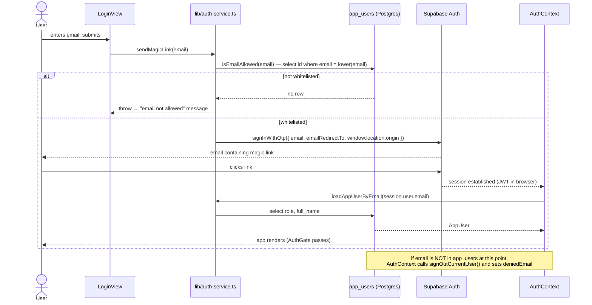
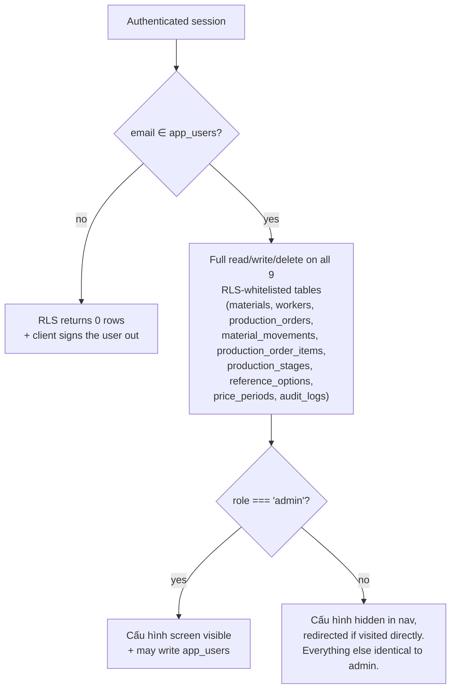

# 06 — Authentication & Authorization

> **Generated from source code.** Read line-by-line from `lib/auth-service.ts`,
> `components/auth-context.tsx`, `components/auth-gate.tsx`, `components/login-view.tsx`,
> and migrations `0009`–`0011`.

---

## Purpose

State exactly how a user gets in, what the system knows about them, and where access is
actually enforced — because the enforcement points are far fewer than the role model suggests.

## Scope

**In scope:** the login mechanism, the whitelist, session→user resolution, the demo-mode
bypass, the role model and every place a role is checked, and the RLS boundary.

**Out of scope:** table definitions (`05-database.md`), UI shell details (`07`).

---

## Current implementation

### Mechanism: Supabase Auth magic link (email OTP). No passwords exist.

There is **no password anywhere in the system** — no password column, no `signInWithPassword`,
no password field in the login form, no hashing code. Authentication is a one-time link
emailed by Supabase Auth.



Key functions (`lib/auth-service.ts`):

| Function | Line | Behavior |
|---|---|---|
| `isEmailAllowed(email)` | `12-23` | selects `app_users.id` by lowercased email. **Returns `true` when Supabase is unconfigured.** |
| `sendMagicLink(email)` | `25-42` | whitelist check, then `signInWithOtp` with `emailRedirectTo: window.location.origin` |
| `loadAppUserByEmail(email)` | `44-55` | resolves `full_name` + `role` from the JWT email |
| `signOutCurrentUser()` | `57-60` | `supabase.auth.signOut()` |
| `loadAppUsers()` | `62-72` | list for the admin screen |
| `createAppUser` / `updateAppUser` / `deleteAppUser` | `74-111` | direct browser writes to `app_users`, gated only by RLS |

### The gate

```tsx
// components/auth-gate.tsx
if (!isSupabaseConfigured) return <>{children}</>;   // :11 — demo mode, NO auth
if (!appUser) return <LoginView … />;                // :13
return <>{children}</>;
```

**Demo mode is unauthenticated by design.** With `NEXT_PUBLIC_SUPABASE_URL` /
`NEXT_PUBLIC_SUPABASE_ANON_KEY` absent, the whole app renders with no login at all and
`lib/demo-data.ts` supplies content. This is intentional for local development, but it means
*a deployment missing its env vars is a fully open application*.

`components/auth-context.tsx:24-46` subscribes to the Supabase session, resolves the
`AppUser`, and signs out any authenticated email that is not whitelisted (setting
`deniedEmail` so `LoginView` can explain the rejection).

### Authorization: a binary whitelist, plus one UI-only role check



**Two different "nine tables" exist in this codebase's documentation — do not conflate them:**

| Set | Membership | Defined by |
|---|---|---|
| **RLS-whitelisted tables** (above diagram) | `materials`, `workers`, `production_orders`, `material_movements`, `production_order_items`, `production_stages`, `reference_options`, `price_periods`, `audit_logs` — **includes `price_periods`, excludes `app_users`** | the set of tables carrying the `<tbl>_whitelisted_access` policy from migrations `0010`/`0022` — a policy-scope grouping |
| **Live application tables** (`00-project-overview.md`, `05-database.md`) | `production_orders`, `production_order_items`, `material_movements`, `materials`, `workers`, `production_stages`, `reference_options`, `app_users`, `audit_logs` — **includes `app_users`, excludes `price_periods`** | the set of tables actually targeted by a `.from("…")` call anywhere in `lib/` — a usage grouping |

They differ because `price_periods` is protected by the same whitelist policy as the real
business tables (migration `0010` looped it in) but the application never queries it, while
`app_users` is queried constantly (login, whitelist checks, the Cấu hình screen) but carries
its own separate policies (`app_users_select_all`, `app_users_admin_write`) rather than the
`<tbl>_whitelisted_access` policy — so it is outside the RLS-whitelisted set even though it is
squarely inside the live-tables set. Both sets happen to have nine members; that is a
coincidence, not a sign they are the same set.

**Roles** (`lib/auth-service.ts:3`, default in migration `0009`):
`"admin" | "nhan_vien"`.

**Every enforcement point in the entire system — six in total:**

| # | Location | What it does |
|---|---|---|
| 1 | `components/material-dashboard.tsx:625` | `const isAdmin = appUser?.role === "admin"` |
| 2 | `components/material-dashboard.tsx:628-632` | `router.replace("/")` if a non-admin is on Cấu hình |
| 3 | `components/material-dashboard.tsx:635-640` | only loads `app_users` / admin master data when `isSettings && isAdmin` |
| 4 | `components/app-shell.tsx:52` | hides the "Cấu hình" nav item for non-admins |
| 5 | `components/app-shell.tsx:106` | role label display only |
| 6 | migration `0010`/`0011` — `app_users_admin_write` policy | only admins may write `app_users` |

Points 1–5 are **client-side only** and therefore advisory: a `nhan_vien` who calls the
service functions from the console, or the Supabase REST endpoint directly, can create,
update, and delete materials, workers, stages, reference options, production orders, and
movements exactly as an admin can. Point 6 is the only server-enforced role rule.

### RLS as the real boundary

Because there is no application server, **Postgres RLS is the entire authorization layer**.
Policy shape (migration `0010`):

```sql
create policy "<tbl>_whitelisted_access" on <tbl>
  for all using (is_whitelisted_user()) with check (is_whitelisted_user());
```

`is_whitelisted_user()` = *"the JWT's email exists in `app_users`"*. It answers **who**, never
**what** — there is no per-table, per-operation, or per-role differentiation.
Full policy inventory in `05-database.md`.

---

## Important rules

1. **Never rely on a client-side role check for security.** Treat points 1–5 above as UX
   affordances only. If an operation must be restricted, it needs an RLS policy.
2. **Do not add a password flow.** The system is magic-link only; adding passwords would mean
   introducing credential storage that currently does not exist.
3. **New users must be added to `app_users` first** — otherwise the magic link is refused at
   `isEmailAllowed`, and any session that somehow appears is force-signed-out.
4. **Every new table needs an RLS policy** in the same migration that creates it. Tables
   default to unprotected (see L-03).
5. **Never deploy without both `NEXT_PUBLIC_*` env vars set** — a missing pair silently turns
   authentication off entirely.
6. **The anon key is public.** It ships in the browser bundle. All confidentiality rests on
   RLS, so never assume "the client wouldn't call that".
7. Emails are compared **lowercased**. Keep `app_users.email` lowercase.

   Source:
   - `lib/auth-service.ts`
   - Function: `isEmailAllowed`
   - Logic: `.trim().toLowerCase()` applied before the whitelist lookup (`:18` at time of writing)

## Related source code

| File | Lines | Role |
|---|---|---|
| `lib/auth-service.ts` | 111 | magic link, whitelist, `app_users` CRUD |
| `components/auth-context.tsx` | 83 | session subscription, `AppUser` resolution, denial |
| `components/auth-gate.tsx` | 16 | render gate + demo-mode bypass |
| `components/login-view.tsx` | 79 | email form (native `required` + `type="email"`) |
| `lib/supabase.ts` | 10 | `isSupabaseConfigured` — the demo-mode switch |
| `components/app-shell.tsx` | 133 | nav gating + role label + sign-out |
| `components/material-dashboard.tsx` | 884 | `isAdmin` derivation and settings redirect |

## Related database

- `app_users` (migration `0009`) — `id`, `email` (unique), `full_name`, `role`
  (default `nhan_vien`). Seeded with `admin@example.com` / `admin`.
- `idx_app_users_email` (`0009`).
- Policies: `app_users_select_all`, `app_users_admin_write` (`0009`, fixed in `0011`),
  and `<tbl>_whitelisted_access` on eight business tables (`0010`) plus
  `production_order_items` (`0022`).
- Supabase's own `auth.users` holds the identities; the app never reads it directly.

## Known limitations

- **L-02** `app_users_select_all using (true)` — **any anonymous caller can read every user's
  email, name, and role.**
- **L-03** ~24 tables from migrations `0002`/`0004` have no RLS → fully open to the anon key.
- **L-04** Role is unenforced on all business and master data; `nhan_vien` ≡ `admin` except
  for `app_users` writes.
- `isEmailAllowed` returns `true` when Supabase is unconfigured, and `AuthGate` renders the
  app with no login in that state — a deployment misconfiguration becomes an open app.
- User administration is performed by direct browser writes; the only protection is the
  `app_users_admin_write` policy.
- No session-timeout handling, no re-authentication for sensitive actions, no audit of
  login/logout events (`audit_logs` records business actions only).
- No rate limiting on `sendMagicLink` beyond Supabase's own defaults.

## Future improvements

1. Replace `app_users_select_all using (true)` with
   `using (email = auth.jwt() ->> 'email' or is_admin_user())`.
2. Add RLS to the 24 unprotected tables, or drop them.
3. Introduce role-aware policies where `nhan_vien` should be read-only (master data,
   `production_stages`, `reference_options`).
4. Fail closed when Supabase is unconfigured in a production build — keep the demo bypass
   for local development only (e.g. gate it on `process.env.NODE_ENV !== "production"`).
5. Record `login` / `logout` / `access_denied` events in `audit_logs`.
6. Consider a third role (e.g. `ke_toan`) once role-aware RLS exists, matching the real
   organizational split between workshop staff and accounting.
