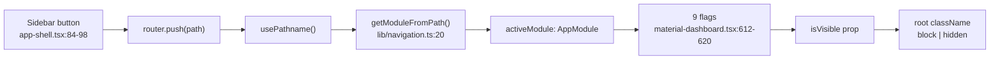

# 07 — UI & Navigation

> **Generated from source code.** Every `page.tsx` was read; the `block`/`hidden` pattern was
> verified at each view's root element.

---

## Purpose

Explain the navigation model (which is unusual), the module→component map, the drawer
conventions, and the shared UI primitives — so UI changes land in the right place and the
single-mount design is not broken by accident.

## Scope

**In scope:** routing, module switching, per-module component map, drawer/overlay patterns,
loading/empty/error conventions, form primitives, theming, accessibility state.

**Out of scope:** business rules behind the forms (`01`), data flow (`02`).

---

## Current implementation

### Navigation: nine routes, zero real pages

Every `app/**/page.tsx` is:

```tsx
export default function Page() {
  return null;
}
```

The UI is mounted once in `app/layout.tsx` and **persists across all navigation**. The route
only supplies a label:



Module ↔ route map (`lib/navigation.ts:1-11` — the single source):

| Label | Route |
|---|---|
| Dashboard | `/` |
| Lệnh sản xuất | `/lenh-san-xuat` |
| Nhật ký NVL | `/nhat-ky-nvl` |
| Ghi nhận công đoạn | `/ghi-nhan-cong-doan` |
| Giá & định mức | `/gia-dinh-muc` |
| Tồn hộp thợ | `/ton-hop-tho` |
| Báo cáo hao hụt | `/bao-cao-hao-hut` |
| Audit log | `/audit-log` |
| Cấu hình | `/cau-hinh` |

`getModuleFromPath` falls back to `"Dashboard"`; `getPathForModule` falls back to `"/"`.
The sidebar's icon list is a **separate** array in `app-shell.tsx:17-27` — the two lists must
be kept in sync manually.

### Visibility toggling, not mounting

Each view's root element carries the pattern:

```tsx
className={`${isVisible ? "block" : "hidden"} …`}
```

Verified at: `production-orders-view.tsx:100`, `material-journal-view.tsx:154`,
`stage-entry-view.tsx:68`, `worker-box-view.tsx:229`, `master-data-settings-view.tsx:135`,
`audit-log-view.tsx:17`, `price-table-view.tsx:16`, `loss-report-view.tsx:12`.
Variants: `"grid" : "hidden"` (`dashboard-overview-view.tsx:61`) and
`"unified-stack" : "hidden"` for grouped modules (`material-dashboard.tsx:741`, `:827`).

**Benefit:** navigating away and back preserves scroll, filters, and unsaved form state for
free. **Cost:** all nine modules' `useMemo` chains run on every render (L-07).

### Module → component map

| Module | Primary view | Companions |
|---|---|---|
| Dashboard | `dashboard-overview-view.tsx` (185) | — |
| Lệnh sản xuất | `production-orders-view.tsx` (347) | `production-order-detail-drawer.tsx` (303), `production-order-form-overlay.tsx` (281), `production-order-inline-edit-form.tsx` (114), `production-items-editor.tsx` (211) |
| Nhật ký NVL | `material-journal-view.tsx` (333) | `material-movement-drawer.tsx` (962), `material-journal-print-dialog.tsx` (526) |
| Ghi nhận công đoạn | `stage-entry-view.tsx` (243) | — |
| Giá & định mức | `price-table-view.tsx` (44) | — (static) |
| Tồn hộp thợ | `worker-box-view.tsx` (682) | internal detail drawer |
| Báo cáo hao hụt | `loss-report-view.tsx` (63) | — |
| Audit log | `audit-log-view.tsx` (39) | — |
| Cấu hình | `master-data-settings-view.tsx` (569) | `master-data-context.tsx` (69) |
| shell | `app-shell.tsx` (133) | `auth-gate.tsx`, `login-view.tsx` |

### Drawer & overlay conventions — three different patterns

| Pattern | Used by | Behavior |
|---|---|---|
| **Unmount** | `material-movement-drawer.tsx:130`, `production-order-form-overlay.tsx:44`, `material-journal-print-dialog.tsx:415` | `if (!isOpen) return null` |
| **Transform slide** | `production-order-detail-drawer.tsx:63-66` | always rendered; `isOpen ? "translate-x-0" : "pointer-events-none translate-x-full"` |
| **Nested slide** | `worker-box-view.tsx:502-504` | same transform approach inside the view |

The transform pattern has a consequence: an ancestor with `transform` creates a new
containing block, so `position: fixed` children are mis-anchored. That is why
`SearchableSelect` renders its dropdown panel through a **portal to `document.body`** with
coordinates from `getBoundingClientRect()` (`production-ui.tsx:144-150`, `:280-334`).

### Header composition inside drawers

Both major drawers share a compact header: eyebrow → code → `DrawerHeaderMeta` tile row →
status pills.

```tsx
<DrawerHeaderMeta items={[
  { label: "Mã hàng",   value: … , tone: … },
  { label: "Công đoạn", value: … , tone: "sky" },
  { label: "Thợ",       value: … , tone: "amber" },
  { label: "Giao dịch", value: … , tone: "jade" }
]} />
```

`tone` conveys state: `default` (has value), `amber` (missing/needs attention),
`sky` (current stage), `jade` (positive count).

### Standard UI states

| State | Implementation | Notes |
|---|---|---|
| Loading | `"Đang tải dữ liệu..."` in the sidebar (`app-shell.tsx:101`) | single global indicator; no skeletons |
| Error | fixed top-right dismissible card (`app-shell.tsx:56-74`) driven by `remoteError` | **also** carries form-validation messages |
| Success | `savedMovementNotice` toast, auto-clears after 4500 ms (`use-material-movements.ts:30`) | movement saves only |
| Empty | plain sentences beginning "Chưa có…" | not a shared component |

Empty-state examples: `production-ui.tsx:380` "Chưa có dữ liệu cần hiển thị trong nhóm này.",
`worker-box-view.tsx:458` "Chưa có dữ liệu tồn hợp thợ để hiển thị.",
`material-journal-view.tsx` "Chưa có giao dịch NVL phát sinh theo bộ lọc hiện tại."

### Filter convention

Introduced consistently across modules: a **primary filter row** (most-used control +
search box) plus a **"Lọc thêm"** toggle that reveals secondary filters in a `bg-paper` panel
with a "Xóa lọc" reset. Present in `production-orders-view.tsx`,
`material-journal-view.tsx`, and `worker-box-view.tsx`.

### Shared primitives — `components/production-ui.tsx` (435 lines)

| Export | Purpose |
|---|---|
| `fieldControlClass` | shared `h-11` input class; suppresses native focus rings in favor of a consistent jade ring |
| `FieldShell` | label + required asterisk + optional hint wrapper; labels are `select-none` |
| `DateInput` | hidden native `<input type="date">` under a display overlay showing `dd/mm/yy`, so date display is locale-independent |
| `SelectControl` | back-compat shim: reads JSX `<option>` children and delegates to `SearchableSelect` |
| `SearchableSelect` | custom combobox — type-to-filter directly in the field, portal panel, grouped options, `displayLabel` support, Escape/outside-click/scroll to close |
| `DrawerHeaderMeta` | the 4-tile status row in drawer headers |
| `InfoMetric` | stat card with optional `tone` for warning color |
| `DetailGroup`, `DetailInlineList` | read-only label/value blocks; filter out empty values via `hasMeaningfulDisplayValue` |
| `DrawerSection` | titled section with optional note |

`SearchableSelect` design notes: the whole field is a real `<input>` (so clicking anywhere
focuses and typing filters immediately), with a chevron button that also opens the panel.
Selected values may render a short `displayLabel` (e.g. `24K`) while the full label
(`NL24K – Nguyên liệu Vàng 24K`) remains searchable and appears as the `title` tooltip.

### Theme

`tailwind.config.ts:9-13` defines a warm monochrome palette — `ink` `#1a1714`,
`jade` `#4a443b`, `brass` `#9a7b3f`, `paper` `#efe9e2`, `line` `#e0dacd` — and **overrides
`zinc` and `emerald`** to neutral brown tones so no accidental blue/green enters the UI.
Layout classes `.shell-grid`, `.content-shell`, `.unified-stack` live in `app/globals.css:58-80`
with a mobile override at `:99`.

---

## Important rules

1. **`app/**/page.tsx` must stay `return null`.** No UI, no data fetching, ever.
2. **Add a new module in three places:** `lib/navigation.ts`, the `navItems` array in
   `app-shell.tsx`, and a visibility flag + render slot in `material-dashboard.tsx`.
3. **Views are presentational.** They receive data and callbacks as props; they must not call
   services or own remote state.
4. **Use the primitives** in `production-ui.tsx` rather than raw `<input>`/`<select>` —
   that is what keeps field height, focus ring, and date format consistent.
5. **Icon-only buttons need both `title` and `aria-label`.** Filter inputs and selects without
   a visible label need `aria-label`.
6. **Keep copy terse.** Do not restate the page title in a caption, and do not add
   explanatory sentences for self-evident controls; the header already carries module context.
7. **Never use blue or green utility colors** — the palette overrides `zinc`/`emerald`
   deliberately.

## Related source code

| File | Role |
|---|---|
| `app/layout.tsx` | mounts everything once |
| `lib/navigation.ts` | module ↔ route mapping |
| `components/app-shell.tsx` | nav, header, global loading/error |
| `components/material-dashboard.tsx` | visibility flags, render slots, prop wiring |
| `components/production-ui.tsx` | shared primitives |
| `app/globals.css`, `tailwind.config.ts` | layout classes and palette |

## Related database

No table drives navigation. `reference_options` supplies dropdown vocabularies consumed
through `getDynamicOptions` (`material-dashboard.tsx:509-513`), which falls back to the
static lists in `lib/production-journal-options.ts` when the table has no rows for a
`list_key`. `app_users.role` controls visibility of the Cấu hình item.

## Known limitations

- **L-07** all nine modules stay mounted, so every module recomputes on every render.
- Nav labels are duplicated between `lib/navigation.ts` and `app-shell.tsx:17-27`.
- Three inconsistent drawer patterns (unmount vs transform) coexist.
- **Accessibility gaps (L-08):** `production-ui.tsx` has **no aria attributes at all**.
  `SearchableSelect` lacks `role="combobox"`, `aria-expanded`, `role="listbox"/"option"`,
  and arrow-key navigation — keyboard-only users cannot pick an option. No drawer has
  `role="dialog"`, `aria-modal`, a focus trap, focus restore, or Escape-to-close.
  `FieldShell` renders a `<span>` label with no `htmlFor` association. Tables use `<th>`
  without `scope`. The error toast is not a live region, so errors are not announced.
  The sidebar has no `aria-current` for the active item.
- Only one global loading indicator; individual tables never show a busy state.
- `remoteError` conflates transport errors with validation messages, so field errors appear
  as a corner toast far from the offending input.
- `material-movement-drawer.tsx` (962) and `worker-box-view.tsx` (682) are oversized.
- No responsive treatment beyond one mobile override; wide tables rely on horizontal scroll.

## Future improvements

1. Add a full accessibility pass: rebuild `SearchableSelect` with proper combobox semantics
   and keyboard navigation, wrap drawers in a focus-trapped `role="dialog"`, make
   `FieldShell` emit real `<label htmlFor>`, add `aria-current` to the nav and
   `role="alert"` to the toast.
2. Derive the sidebar `navItems` from `lib/navigation.ts` to remove the duplicate list.
3. Standardize on one drawer pattern (transform-slide, since `SearchableSelect` already
   accommodates it).
4. Split the validation channel out of `remoteError` and render field-level errors inline.
5. Extract shared empty-state and table-toolbar components.
6. Split `master-data-settings-view.tsx` into per-tab components and
   `material-movement-drawer.tsx` into info-tab / stage-tab / worker-block components.
