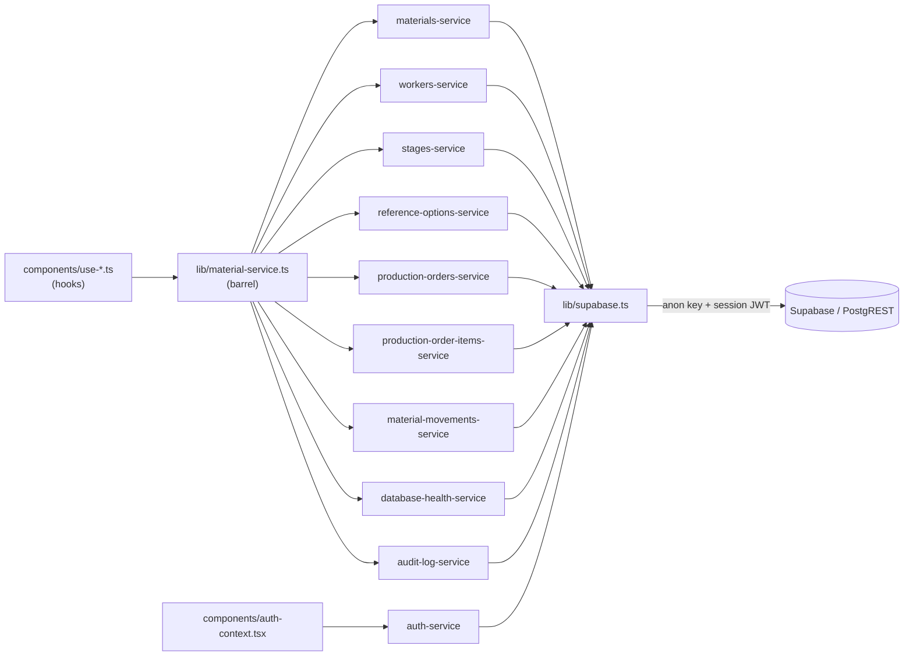
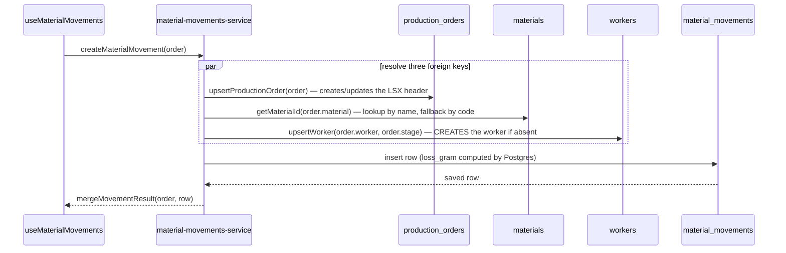
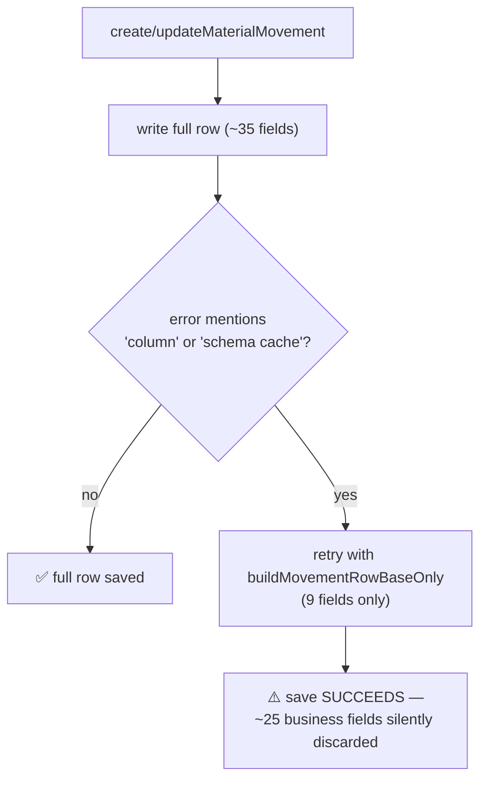

# 08 — API & Services

> **Generated from source code.** Signatures copied from the actual `export` statements.
> The absence of HTTP endpoints was confirmed by exhaustive search, not assumption.

---

## Purpose

Document the only data-access contract the application has — the `lib/*-service.ts` layer —
including the non-obvious side effects and the silent-degradation paths that can make a save
"succeed" while losing fields.

## Scope

**In scope:** why there is no HTTP API, the service inventory with full signatures, the
movement write sequence, error and fallback behavior, and the hook→service mapping.

**Out of scope:** table definitions (`05`), business rules applied before saving (`01`).

---

## Current implementation

### There is no HTTP API

Verified absent: `app/api/**`, any `route.ts`/`route.tsx`, any `"use server"` directive,
`getServerSideProps`, `getStaticProps`. `app/layout.tsx` is the only server component and it
performs no data work.

**The service layer *is* the API.** Client hooks call `lib/*-service.ts` functions, which call
`supabase-js`, which issues PostgREST HTTP requests to Supabase using the public anon key and
the user's session JWT. Authorization happens in Postgres (see `06-authentication.md`).



**Import rule:** consumers import from the barrel `@/lib/material-service`, never from the
individual service files. The barrel exists so services can be split without touching call
sites (`lib/material-service.ts`).

### Service inventory

#### Movements — `lib/material-movements-service.ts`

| Function | Signature |
|---|---|
| `loadProductionOrders` | `(): Promise<ProductionOrder[]>` |
| `createMaterialMovement` | `(order: ProductionOrder): Promise<ProductionOrder>` |
| `updateMaterialMovement` | `(order: ProductionOrder): Promise<ProductionOrder>` |
| `updateMaterialMovementStatus` | `(id: string, status: Status)` |
| `deleteMaterialMovement` | `(id: string)` |

(Line numbers are omitted here — prefer the function name; the file has grown by roughly
25 lines since this document was first written, and line numbers alone go stale quickly.)

**Hidden side effects of a movement save** — this is the most surprising part of the layer:



Consequences to know (source: `lib/material-movements-service.ts`):
- Saving a movement **can create an LSX header** that did not exist — function
  `upsertProductionOrder` (`:258-318` at time of writing) — this is what makes "journal
  before order" workflows possible.
- Saving a movement **can create a worker** — function `upsertWorker` (`:233-256` at time of
  writing) — by upserting on `worker_code` derived from the name. A typo in a worker name
  silently creates a new worker.
- Master data is matched **by display name**, not id — function `getMaterialId`
  (`:215-231` at time of writing).

**Reads now surface the master-data ids, writes still do not use them.** `material_movements`
has stored `material_id` / `worker_id` as `not null` foreign keys since migration `0001`, and
`MOVEMENT_SELECT_COLUMNS` now selects both, so `movementRowToProductionOrder` populates
`ProductionOrder.materialId` / `.workerId`. This is read-only: **`getMaterialId` and
`upsertWorker` are unchanged and still resolve master data by `materials.name` /
`workers.full_name`**, and nothing writes those id fields back from the domain object. Switching
the write path (and the UI option values) to ids is deferred — see
`tasks/backlog/009-low-priority.md`.

#### LSX headers — `lib/production-orders-service.ts`

| Function | Signature |
|---|---|
| `loadProductionOrderHeaders` | `(): Promise<ProductionOrderHeaderRecord[]>` |
| `createProductionOrderHeader` | `(input: ProductionOrderHeaderInput)` |
| `updateProductionOrderHeader` | `(orderCode: string, input: ProductionOrderHeaderInput)` |
| `updateProductionOrderStatus` | `(orderCode: string, status: Status)` |

`updateProductionOrderHeader` can change `order_code`; the FK on
`production_order_items.order_code` is `on update cascade`, so items follow automatically.

#### LSX items — `lib/production-order-items-service.ts`

| Function | Signature |
|---|---|
| `loadProductionOrderItems` | `(): Promise<ProductionOrderItemRecord[]>` |
| `replaceProductionOrderItems` | `(orderCode: string, items: ProductionOrderItem[]): Promise<void>` |
| `updateProductionOrderItemStatus` | `(orderCode, sku, status): Promise<void>` |
| `updateProductionOrderItemDeliveryStatus` | `(orderCode, sku, deliveryStatus): Promise<void>` |

`replaceProductionOrderItems` is **delete-all-then-insert** for that `order_code`. Per-item
`status`/`delivery_status` survive only because the caller's draft carries the current values.

#### Master data (uniform CRUD shape)

| Service | Functions |
|---|---|
| `materials-service.ts` | `loadMaterials`, `createMaterial`, `updateMaterial`, `deleteMaterial` |
| `workers-service.ts` | `buildWorkerCode`, `loadWorkers`, `createWorker`, `updateWorker`, `deleteWorker` |
| `stages-service.ts` | `loadStages`, `createStage`, `updateStage`, `deleteStage` |
| `reference-options-service.ts` | `loadReferenceOptions`, `createReferenceOption`, `updateReferenceOption`, `deleteReferenceOption` |

All follow `create/update(input: Omit<T, "id">)` and `delete(id: string)`.

#### Auth — `lib/auth-service.ts` (111 lines)
`isEmailAllowed`, `sendMagicLink`, `loadAppUserByEmail`, `signOutCurrentUser`,
`loadAppUsers`, `createAppUser`, `updateAppUser`, `deleteAppUser`. See `06-authentication.md`.

#### Support services
- `database-health-service.ts:4` — `loadDatabaseHealth(): Promise<DatabaseHealth>`; counts rows
  in five tables for the dashboard.
- `audit-log-service.ts:3` — `createAuditLog(action, detail, entityId?)`. **Insert only** —
  nothing ever reads `audit_logs` back (L-06).

#### Pure computation, no Supabase — `lib/worker-box-service.ts` (328 lines)
`buildWorkerBoxLinesFromMovements`, `filterWorkerBoxLines`, `summarizeWorkerBoxLines`,
`getDefaultWorkerBoxPeriodCode`, `getWorkerBoxPeriod`, `parseWorkerBoxPeriodCode`,
`formatWorkerBoxMonthLabel/YearLabel/PeriodLabel`, `getPeriodsFromLines`,
`buildWorkerBoxQueryKey`. Despite the `-service` suffix this module **never touches the
database** — the Tồn hộp thợ module is computed in the browser.

### Error handling and fallbacks

Three distinct behaviors — know which one you are calling:

| Behavior | Where | Effect |
|---|---|---|
| **Throws** | movements, headers, master data, auth | error propagates to the hook → `setRemoteError` → global toast |
| **Silently degrades** | `material-movements-service.ts`, `production-order-items-service.ts` | operation *appears* to succeed with fewer fields, or does nothing |
| **Swallows and returns empty** | `stages-service.ts` (function `loadStages`), `reference-options-service.ts` (function `loadReferenceOptions`) | `console.error` + `[]`; UI shows an empty list |
| **Aggregates errors into a status string, still returns counts** | `database-health-service.ts` (function `loadDatabaseHealth`) | per-table errors are joined into `errorMessage`; `counts` still reflects whatever tables succeeded — this does *not* swallow-and-return-empty like the row above |

#### ⚠ The schema-cache fallback (most important operational hazard)

Because migrations are applied by hand and PostgREST caches the schema, services guard against
"column not found" errors:

```ts
// lib/material-movements-service.ts:76-77
function isMissingColumnError(message: string | undefined) {
  return Boolean(message?.includes("column") || message?.includes("schema cache"));
}
```



Fallback sites (line numbers are approximate and drift as the files change — prefer the
function name):

| File | Function | Degrades to |
|---|---|---|
| `material-movements-service.ts` | `loadProductionOrders` (`:200-205`) | reduced column set; dates, documents, `item_sku`, sources, converted weights all become `""`/`0` |
| `material-movements-service.ts` | `createMaterialMovement` | inserts 9 fields; the rest are lost |
| `material-movements-service.ts` | `updateMaterialMovement` | updates 9 fields; **existing extended data is not preserved** |
| `production-order-items-service.ts` | `loadProductionOrderItems` | returns `[]` → app falls back to legacy single-SKU header fields |
| `production-order-items-service.ts` | `replaceProductionOrderItems` (delete step) | no-op |
| `production-order-items-service.ts` | `replaceProductionOrderItems` (insert step) | **items silently not saved** |
| `production-order-items-service.ts` | `updateProductionOrderItemStatus` | silent no-op |
| `production-order-items-service.ts` | `updateProductionOrderItemDeliveryStatus` | silent no-op |

The trigger is a **substring match on the error message**, so any error text containing the
word "column" activates the reduced path. Tightening this is the subject of the active task
`tasks/active/REL-3-stop-silent-column-fallback.md`.

`production-orders-service.ts` deliberately has **no** fallback — it throws with a hint to run
the migration, which is the safer design.

### Hook → service mapping

| Hook | Services used |
|---|---|
| `use-operational-data.ts` | all eight loaders (the only bulk reader) |
| `use-material-movements.ts` | `createMaterialMovement`, `updateMaterialMovement`, `deleteMaterialMovement`, `createAuditLog` |
| `use-production-orders.ts` | `createProductionOrderHeader`, `updateProductionOrderHeader`, `replaceProductionOrderItems`, `updateProductionOrderItemDeliveryStatus`, `createAuditLog` |
| `use-selected-production-order.ts` | `createMaterialMovement`, `updateProductionOrderStatus`, `updateProductionOrderItemStatus`, `createAuditLog` |
| `use-master-data-crud.ts` | all master-data CRUD + `app_users` CRUD |
| `auth-context.tsx` | `loadAppUserByEmail`, `signOutCurrentUser` |

---

## Important rules

1. **Import from the barrel** `@/lib/material-service`.
2. **Only `lib/*-service.ts` may touch Supabase.** Hooks, views, and business-rule modules
   must not construct queries.
3. **Never write generated columns** — `loss_gram` will be rejected.
4. **Know that a movement save mutates three other tables.** If you add validation, add it
   before `persistMovement`, not inside the service.
5. **Do not add new silent fallbacks.** New services should throw with an actionable message,
   following `production-orders-service.ts`.
6. **After any DDL, run `notify pgrst, 'reload schema';`** or every write will take the
   degraded path.
7. **Services return domain objects, never raw rows** — conversion belongs in
   `lib/supabase-mappers.ts`.

## Related source code

`lib/material-service.ts` (barrel) · `lib/supabase.ts` · `lib/supabase-mappers.ts` ·
`lib/material-movements-service.ts` · `lib/production-orders-service.ts` ·
`lib/production-order-items-service.ts` · `lib/materials-service.ts` ·
`lib/workers-service.ts` · `lib/stages-service.ts` · `lib/reference-options-service.ts` ·
`lib/auth-service.ts` · `lib/audit-log-service.ts` · `lib/database-health-service.ts` ·
`lib/worker-box-service.ts` (pure)

## Related database

Each service owns one table, except `material-movements-service.ts`, which also upserts
`production_orders`, `materials`, and `workers`. Column lists are centralized as constants
`MOVEMENT_SELECT_COLUMNS` and `MOVEMENT_SELECT_COLUMNS_FALLBACK` near the top of
`material-movements-service.ts`. See `05-database.md`.

`MOVEMENT_SELECT_COLUMNS` includes the master-data foreign keys `material_id` and `worker_id`
(alongside `order_id`). `MOVEMENT_SELECT_COLUMNS_FALLBACK` **intentionally omits them** — it is
the reduced degraded select used when PostgREST reports a missing column, so
`ProductionOrder.materialId` / `.workerId` are `undefined` on that path and every consumer must
treat them as optional.

## Known limitations

- **L-05** silent schema-cache fallbacks can save a movement missing ~25 fields, or drop LSX
  items entirely, with no user-visible warning. The trigger is a fragile substring match.
- **L-06** `audit_logs` is written but never read by the UI.
- Master data is bound **by name**; renaming a worker or material orphans historical rows, and
  a mistyped worker name creates a new worker record.
- `replaceProductionOrderItems` deletes then re-inserts, so item `id`s and `created_at` are not
  stable across edits.
- No retry, timeout, cancellation, or request deduplication anywhere.
- No pagination on any loader — every list loads in full on mount.
- `stages-service` and `reference-options-service` swallow errors into empty arrays, so a
  failure looks like "no data".
- `worker-box-service.ts` is named like a data service but performs no I/O — misleading.

## Future improvements

1. Complete `tasks/active/REL-3`: classify schema errors by PostgREST/Postgres **error code**
   (`PGRST204`, `42703`) instead of message text, and surface a visible warning whenever the
   fallback path is taken.
2. Reference master data by id on movements while keeping denormalized display names.
3. Add pagination or date-window filters to `loadProductionOrders` before the journal grows large.
4. Have the Audit log screen read `audit_logs` instead of session memory.
5. Rename `worker-box-service.ts` → `worker-box-calculations.ts` to reflect that it is pure.
6. Make `replaceProductionOrderItems` a real upsert keyed on `(order_code, sku)`.
