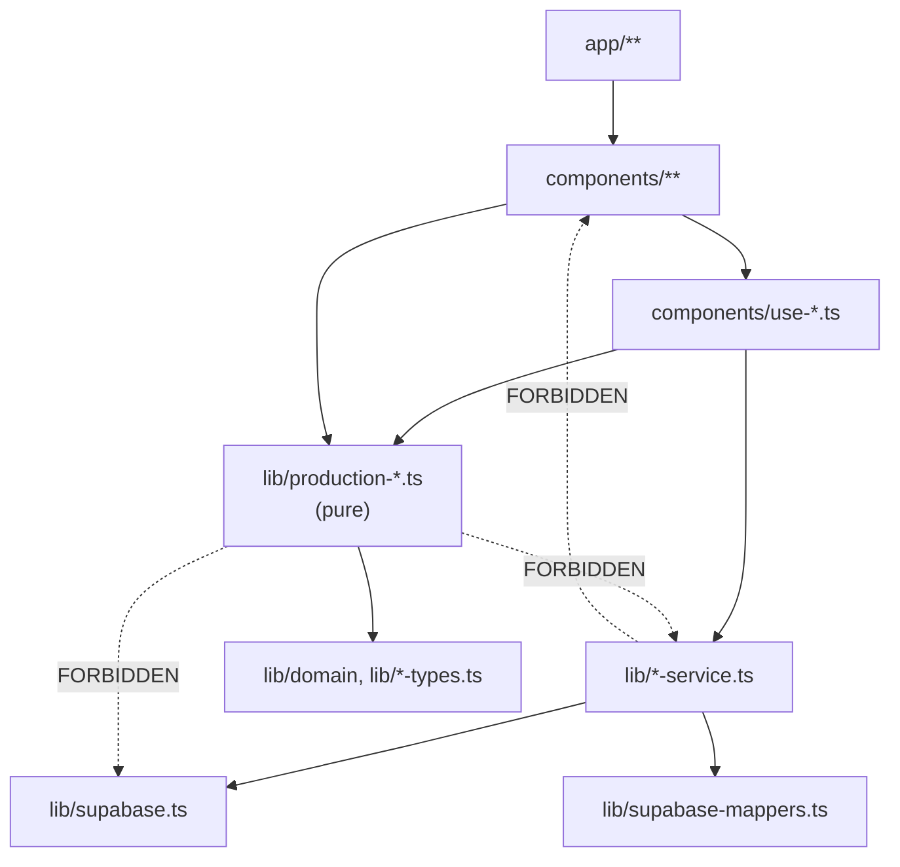

# 09 — Coding Standard

> **Generated from source code.** These are the conventions the codebase actually follows,
> derived by reading it — not an aspirational style guide. Where the code is inconsistent,
> that is stated explicitly.

---

## Purpose

Let a new contributor (human or AI) write code that is indistinguishable from what is already
there, and know which existing patterns are deliberate versus accidental.

## Scope

**In scope:** TypeScript settings and usage, naming, file organization, comment language,
layer import rules, numeric handling, UI text, accessibility requirements, React patterns.

**Out of scope:** testing (`10`), the completion gate (`13`).

---

## Current implementation

### TypeScript

`tsconfig.json`: `strict: true`, `target: ES2017`, `moduleResolution: "bundler"`,
`noEmit: true`, `jsx: "preserve"`, path alias `@/*` → repo root.

Observed discipline is high:
- **`any`: 2 occurrences** in the entire codebase — both `let result: any = await supabase…`
  in loaders that need to reassign after a fallback query
  (`material-movements-service.ts:195`, `production-orders-service.ts:9`).
- **Non-null assertion: 3 occurrences** — `lib/production-helpers.ts`
  (`hasMeaningfulDisplayValue`, `:52`) and two in `lib/production-journal-options.ts`
  (`groupNxtLinkOptions`, `:241`; `groupMaterialTypeOptions`, `:281` — both
  `groups.get(label)!` after a preceding `.set()` call in the same loop iteration).
- No `@ts-ignore`, no `@ts-expect-error`.

Explicit return types are used on exported pure functions; inferred returns are accepted on
React components and local helpers.

**Known weakness:** `Status` is declared `= string` (`lib/domain/production.ts:3`) rather than
a union, so status literals are unchecked. Compare against the exported option arrays
(`statusOptions`, `movementLossStatusOptions`, …) rather than writing literals inline.

### Naming

| Kind | Convention | Examples from code |
|---|---|---|
| Files: views | `kebab-case-view.tsx` | `production-orders-view.tsx` |
| Files: slide-overs | `*-drawer.tsx` | `material-movement-drawer.tsx` |
| Files: full-screen | `*-overlay.tsx` | `production-order-form-overlay.tsx` |
| Files: hooks | `use-*.ts` | `use-material-movements.ts` |
| Files: data access | `*-service.ts` | `materials-service.ts` |
| Files: pure rules | `production-*.ts` | `production-business-rules.ts` |
| Components | `PascalCase` | `MaterialJournalView` |
| Functions | `camelCase`, **named after business intent** | `buildProductionOrderCode`, `getCarryOverLossPeriod`, `pickCurrentStagePerOrder`, `buildWorkerBoxLinesFromMovements` |
| Booleans | `is` / `has` / `can` / `should` prefix | `isClosedStatus`, `isSingleWorkerStage`, `shouldForceDirectCharge`, `hasMeaningfulText` |
| Builders | `build*` for construction, `pick*` for selection, `format*` for display, `normalize*` for canonicalization | `buildOrderSummaries`, `pickText`, `formatGram`, `normalizeStageCode` |
| Constants | `SCREAMING_SNAKE_CASE` | `SINGLE_WORKER_STAGE_CODES`, `ALL_STAGES_FILTER`, `SAVED_NOTICE_DURATION_MS` |
| DB columns | `snake_case` | `issued_gram`, `delivery_status` |
| Domain fields | `camelCase` | `issued`, `deliveryStatus` |

Avoid generic names — there is no `Utils`, `Manager`, `Helper`, or `processData` anywhere, and
new code should keep it that way. `production-helpers.ts` is the one legacy exception.

**Use the same domain term across code, DB, and UI.** `hao hụt` → `loss`/`loss_gram`;
`tuổi vàng` → `goldAge`/`gold_age`; `Mã hàng` → `sku`/`itemSku`; `Mã LSX` → `code`/`order_code`.
The glossary is embedded in `04-domain-model.md`.

### Comment language and style

**Code comments are in Vietnamese without diacritics**; UI strings are Vietnamese *with*
diacritics. This is consistent across the codebase and intentional.

Comments explain **why**, not what, and are used heavily to record decisions that would
otherwise look like bugs:

```ts
// lib/production-mappers.ts:74-77
// Khong dat mac dinh la mot khau cu the (VD "CKE") - de trong de bat
// nguoi dung phai tu chon Cong doan (validateMovementDraft da bat
// buoc truong nay), tranh truong hop luu nham voi khau mac dinh ma
// khong ai thuc su chon.
stage: "",
```

Follow this: when a non-obvious choice is made — especially one that a future reader might
"fix" — leave a comment explaining the reason.

### Layer import rules



Hard rules:
1. `lib/*-service.ts` **must not** import React or anything from `components/`.
2. `lib/production-*.ts` (pure logic) **must not** import Supabase, services, or React.
3. Views **must not** call services — go through a hook.
4. Import services from the barrel `@/lib/material-service`, never the individual file.
5. Business logic belongs in `lib/`. If it can be written as a pure function of its inputs,
   it goes there and gets a test.

### React patterns

**Hooks take one `deps` object.** Every `use-*.ts` accepts a single params object containing
the state and setters it needs, which `material-dashboard.tsx` owns:

```ts
// components/use-material-movements.ts:32-49
type UseMaterialMovementsParams = {
  orders: ProductionOrder[];
  workers: WorkerMaster[];
  stageRules: Record<string, HaoHutRule>;
  // …
  setOrders: Dispatch<SetStateAction<ProductionOrder[]>>;
  pushAudit: (action: string, detail: string) => void;
  setRemoteError: (message: string | null) => void;
};
```

This keeps hooks independently testable and makes their data dependencies explicit. Follow it
for new hooks.

Other observed patterns:
- Views are presentational: props in, callbacks out, no remote state.
- Derived values use `useMemo` with explicit dependency arrays.
- Effects that must run once use `[]` plus an `eslint-disable-next-line
  react-hooks/exhaustive-deps` comment where intentional.
- Re-initialization guards use a `useRef` key rather than extra state
  (`use-selected-production-order.ts:92`).
- `"use client"` at the top of every component and hook file.

### Numbers, dates, currency

- **Weights are `numeric(14,4)` in Postgres and rounded with `.toFixed(4)` in TypeScript.**
  Never use floating-point accumulation without rounding.
- Purity (`goldAge`) is a decimal fraction (`0.75` = 18K), not a percentage.
- Dates are ISO `YYYY-MM-DD` strings in state and DB; display conversion to `dd/mm/yy` happens
  only at the edge (`formatDisplayDate`, and `DateInput` for input fields).
- Period codes are `YYYY-MM` strings (`toMonthCode`).
- Never rely on the browser locale for date rendering — that is precisely why `DateInput`
  overlays a formatted span on a hidden native input.

### UI text

- All user-facing text is Vietnamese with correct diacritics.
- **Be terse.** Do not restate the page or drawer title in a caption; do not add explanatory
  sentences for self-evident controls. Keep a note only when it conveys a real constraint
  (e.g. "LSX đã chốt, các trường bên dưới đang bị khoá").
- Empty states start with "Chưa có…".
- Use the shared primitives from `production-ui.tsx` rather than raw form elements.
- Never introduce blue or green utility colors — the palette deliberately overrides
  `zinc` and `emerald` to warm neutrals (`tailwind.config.ts:9-13`).

### Accessibility requirements

Mandatory for new code:
- Icon-only buttons: both `title` and `aria-label` (mirroring each other).
- Filter inputs/selects without a visible `<label>`: `aria-label`.
- Do not regress what exists; ideally improve it — see the known gaps in `07-ui-navigation.md`.

---

## Important rules

1. **`strict` TypeScript; avoid `any`.** Prefer `unknown` + narrowing for untrusted input.
2. **Never re-implement existing business logic** — check `lib/production-*.ts` first. The loss
   formula already exists in three places; do not add a fourth.
3. **Respect the layer import rules** above; they are what keeps `lib/` testable.
4. **Comment the "why"** on any decision that could be mistaken for a bug.
5. **Round money/weight explicitly** to 4 decimals.
6. **Frontend validation is UX only** — never treat it as a security or integrity guarantee.
   Real enforcement is RLS plus Postgres constraints.
7. **Do not modify generated columns** or write to `loss_gram`.
8. **Keep files under ~400 lines.** Six files already exceed it; do not add a seventh.

## Related source code

Exemplary files to imitate:
- `lib/production-business-rules.ts` — pure, documented, fully tested.
- `lib/production-summary.ts` — aggregation with clear naming and rationale comments.
- `components/use-selected-production-order.ts` — derivation-only hook, no redundant state.
- `lib/materials-service.ts` — the canonical small CRUD service shape.
- `lib/material-service.ts` — the barrel pattern.

Configuration: `tsconfig.json`, `tailwind.config.ts`, `postcss.config.mjs`,
`next.config.mjs` (currently empty), `vitest.config.ts`.

## Related database

Naming bridge: DB `snake_case` ↔ domain `camelCase`, converted in
`lib/supabase-mappers.ts`. Status strings are stored snake_case (`dang_xu_ly`) and mapped to
Vietnamese display values via `toDbStatus`/`fromDbStatus`.

## Known limitations

- **L-12 — ESLint is configured and runs, but is not fully clean and is not yet a mandatory
  gate.** `eslint.config.mjs` exists (flat config, `FlatCompat` wrapping `next/core-web-vitals`
  only), and `npm.cmd run lint` executes successfully. It currently reports 0 errors and 2
  warnings — an unused `eslint-disable` directive in `components/auth-context.tsx`, and an
  `react-hooks/exhaustive-deps` warning in `components/material-dashboard.tsx`. `lint` is not
  yet part of the mandatory checklist in `13-definition-of-done.md`, so every convention in
  this document is still upheld primarily by review, with lint as a partial, not-yet-enforced
  check.
- No Prettier configuration; formatting is by convention (2-space indent, double quotes,
  semicolons, trailing commas omitted in most places).
- `Status = string` defeats type checking on the most important discriminator in the domain.
- `production-helpers.ts` is a grab-bag name that violates the "name by intent" rule.
- Two `any` casts remain in the loaders.
- The loss formula is duplicated three times, contradicting rule 2 above — a known debt, not a
  pattern to copy.
- `worker-box-service.ts` is named `-service` but performs no I/O.

## Future improvements

1. **Resolve the 2 remaining lint warnings** (`react-hooks/exhaustive-deps` in
   `components/material-dashboard.tsx`, the stale `eslint-disable` in
   `components/auth-context.tsx`) and then wire `npm run lint` into the completion gate in
   `13-definition-of-done.md`.
2. Add Prettier with a shared config to remove formatting debate.
3. Convert `Status` to a union and derive option arrays from it.
4. Extract the loss calculation into one exported function in
   `lib/production-business-rules.ts` and have all three call sites use it.
5. Split `production-helpers.ts` into `status-helpers.ts` and `format-helpers.ts`.
6. Add an ESLint rule (or CI check) enforcing the layer import boundaries.
