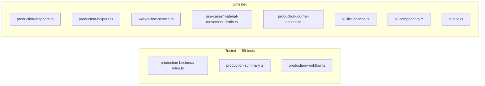

# 10 — Testing

> **Generated from source code.** Test names below are the literal `describe`/`it` strings.
> Counts are actual: **59 tests, 23 describe blocks, 3 files.**

---

## Purpose

State exactly what is verified automatically, what is not, and how to run the suite — so that
"the tests pass" carries an accurate amount of confidence.

## Scope

**In scope:** the test runner setup, complete inventory of covered behavior, the explicit
uncovered list, and conventions for new tests.

**Out of scope:** the release gate (`13-definition-of-done.md`).

---

## Current implementation

### Setup

```ts
// vitest.config.ts
export default defineConfig({
  resolve: { alias: { "@": path.resolve(__dirname, ".") } },
  test: { environment: "node" }
});
```

- Runner: **Vitest 4.1.10**, `environment: "node"`.
- Path alias `@` resolves to the repo root, matching `tsconfig.json`.
- **No** coverage thresholds, **no** setup file, **no** jsdom, **no** testing-library,
  **no** E2E framework (no Playwright/Cypress in `package.json`).

Commands (`npm.cmd` on Windows — PowerShell may block `npm.ps1`):

```bash
npm.cmd run test                                  # all tests (vitest run)
npx vitest run lib/production-workflow.test.ts    # a single file
npx vitest                                        # watch mode
npm.cmd run typecheck                             # tsc --noEmit
```

### What the node environment implies

Because the environment is `node` and no DOM library is installed, **only pure functions are
testable today**. That is exactly why all three test files target `lib/` modules that import
neither React nor Supabase — the layer discipline in `09-coding-standard.md` is what makes the
suite possible.



### Coverage inventory

#### `lib/production-business-rules.test.ts` — 29 tests, 11 describes

| Describe | Covers |
|---|---|
| `buildProductionOrderCode` | first code of a month is seq 1; next seq from highest existing; 2-digit seq after 15 orders; other months ignored; `buildUniqueProductionOrderCode` is an equivalent alias |
| `extractOrderCodeMonth` | 1-digit seq; 2-digit seq; invalid format → `null`; invalid month → `null` |
| `normalizeStageCode` | Vietnamese names with and without diacritics; already-normalized codes pass through |
| `getStageLabel` | known code → full name; unknown code → itself |
| `shouldForceDirectCharge` | blocks `Xác định` on non-`truc_tiep` stages; allows on CKE/DAN; ignores other statuses; honors DB `stageRules` overrides |
| `isLargeWeightMovement` | alarms above 2000 g; silent below |
| `getCarryOverLossPeriod` | keeps current month for closed/`Xác định`/`Treo nợ`; rolls to next month when `Đang xử lý` and day ≥ 28; keeps month before day 28 |
| `getWorkerInventoryRiskStatus` | safe under 5 g; `Đang kiểm soát` on `kiem_soat_rui_ro`; `Rủi ro` otherwise |
| `toMonthCode` | takes `YYYY-MM` from an ISO date |
| `formatDisplayDate` | ISO → `dd/mm/yy`; empty/null → `""` |
| `formatDisplayDateTime` | `dd/mm/yy hh:mm:ss` |

#### `lib/production-summary.test.ts` — 16 tests, 5 describes

| Describe | Covers |
|---|---|
| `selectMovementsForOrder` | filters to one LSX, newest first; empty code → `[]` |
| `computeMovementTotals` | sums `issued`/`returned`/`powder`/`loss`; all-zero on empty |
| `buildOrderSummaries` | merges movements for the same LSX+SKU; header with zero movements still appears (`movementCount = 0`); **multi-SKU isolation** — movements do not leak between Mã hàng; closing one Mã hàng does not mark the others closed; `item.status` falls back to `header.status` (pre-`0024` data); per-item `deliveryStatus` isolation; `deliveryStatus` falls back to header (pre-`0026` data) |
| `buildDraftStageMovements` + `buildStageProgress` | latest movement per stage for the right LSX; marks passed and current stage; zero-movement stage is not current |
| `buildLossReportRows` | converted loss by `goldAge`, sorted descending; groups by stage + worker + material + status |

#### `lib/production-workflow.test.ts` — 14 tests, 7 describes

| Describe | Covers |
|---|---|
| `filterProductionSummaries` | query + deadline bucket; destination + month-from-code |
| `pickCurrentStagePerOrder` | furthest stage in the process wins over a newer date; same stage → newest `occurredDate` |
| `buildStageWorkerAggregates` | totals across **all** workers in a stage, not just the representative; single-worker case; two SKUs in one LSX are not merged |
| `filterJournalOrders` | text/status filtering; stage + `nxtPeriod` + `lossPeriod` + "all" sentinels |
| `buildJournalPeriodOptions` | distinct non-empty months, descending |
| `buildProductionOverview` | totals, no-movement, in-progress, overdue; multi-item LSX counted once |
| `buildSelectedOrderDetail` | latest movement wins for operational fields, header retained for planning fields; picks the selected Mã hàng rather than the LSX's primary |

Note the emphasis: **six of the sixteen `buildOrderSummaries`/workflow tests exist specifically
to protect multi-SKU isolation and item→header fallback** — historically the most bug-prone area.

### Uncovered behavior — explicit list

Nothing below has any automated test:

**Business logic:**
- **The loss formula** — `issued − returned − transferred` at
  `use-material-movements.ts:112`, `production-mappers.ts:331-343`,
  `use-production-orders.ts:491`. The single most important calculation in the system is
  untested, and its three implementations can drift.
- `applyProductionBusinessRules` (document-number generation, `powder = 0` forcing, converted
  weights, period defaults), `convertToPureGoldWeight`, `buildDocumentNo`,
  `getNextDocumentSequence`, `normalizeStageForStorage`, `toIsoDate`.
- The whole status machine: `isClosedStatus`, `getSummaryStatus`, `isSingleWorkerStage`.
- `validateMovementDraft` — all eight required-field rules.
- All of `lib/production-mappers.ts` (357 lines): `mergeMovementWithContext`,
  `mergeProductionHeaderWithDraft`, `mergeItemsStatusFromHeader`,
  `mapRemoteHeaderToProductionHeader`, factories.
- All of `lib/use-cases/material-movement-drafts.ts`, including the
  `Đã chốt` → `Treo nợ` downgrade on reopen.
- All of `lib/worker-box-service.ts` (328 lines): `buildWorkerBoxLinesFromMovements`,
  `filterWorkerBoxLines`, `summarizeWorkerBoxLines`, period helpers.
- `lib/production-journal-options.ts` helpers: `groupNxtLinkOptions`,
  `groupMaterialTypeOptions`, `formatMaterialTypeLabel`, `formatGoldAgeLabel`.
- `lib/master-data-drafts.ts`; most `production-helpers.ts` formatters.

**Everything else:** all 10 services (no integration tests against Supabase, no mocks), all
28 components, all 6 hooks. No rendering test, no interaction test, no accessibility test, no
end-to-end flow.

### Conventions for new tests

Observed and worth keeping:
- One test file per `lib/` module, named `<module>.test.ts`, colocated in `lib/`.
- A local `makeX(overrides: Partial<T>): T` factory at the top of the file
  (`makeOrder`, `makeHeader`, `makeSummary`, `makeMovement`) so each test states only what
  matters.
- `describe` = the function under test; `it` = a Vietnamese sentence describing the business
  behavior (matching how the team talks about the domain).
- Assert on observable output, not internal calls.
- Regression tests are added at the same time as the fix, naming the migration or scenario
  (e.g. *"Ma hang chua co status rieng (du lieu cu truoc migration 0024) fallback ve status
  cua header"*).

---

## Important rules

1. **Never claim tests passed without executing them.** Run `npm.cmd run test` and read the output.
2. **Business logic must be pure to be testable** — that is the reason for the layer rules in
   `09-coding-standard.md`. Put new logic in `lib/`, not in a hook.
3. **Any bug fix in `lib/` ships with a regression test** naming the scenario.
4. **Test observable behavior** (calculations, transitions, filter results), not implementation
   detail.
5. **Do not weaken existing multi-SKU tests** — they encode hard-won correctness about item
   isolation and header fallback.
6. Full verification before completion is `typecheck` + `test` + `build` — see
   `13-definition-of-done.md`.

## Related source code

| File | Tests |
|---|---|
| `lib/production-business-rules.test.ts` (177) | 29 |
| `lib/production-summary.test.ts` (304) | 16 |
| `lib/production-workflow.test.ts` (354) | 14 |
| `vitest.config.ts` (14) | runner config |

## Related database

**No test touches the database.** All three files operate on in-memory fixtures. There is no
test Supabase project, no seeded test schema, and no migration test — so schema/code drift
(the cause of the L-05 fallback behavior) cannot be caught automatically.

## Known limitations

- **L-13** — coverage is narrow: 3 of ~45 `lib`/`components` modules, ~0 % of the UI, and the
  loss formula itself is untested.
- No coverage measurement or threshold configured, so regressions in coverage are invisible.
- `environment: "node"` means components cannot be tested without adding jsdom +
  testing-library.
- No integration tests against Supabase; service behavior (including the silent fallbacks) is
  entirely unverified.
- No E2E test, so the single-mount routing model and drawer flows are only manually validated.
- No test asserts that TypeScript's `Status` values match the DB's `toDbStatus` mapping.
- `next lint` now runs (`eslint.config.mjs`) but reports 2 unresolved warnings and is not yet
  part of the completion gate — see `14-known-limitations.md` L-12.

## Future improvements

1. **Test the loss formula first** — extract it into one function in
   `lib/production-business-rules.ts` and cover it, including the `transferred` vs `powder`
   question (L-01).
2. Cover `validateMovementDraft`, `isClosedStatus`, `getSummaryStatus`, and
   `applyProductionBusinessRules`.
3. Cover `lib/worker-box-service.ts` — 328 lines of reporting arithmetic with zero tests.
4. Cover `lib/production-mappers.ts`, especially the draft-merge precedence rules.
5. Add jsdom + `@testing-library/react` and test the two highest-risk components:
   `material-movement-drawer.tsx` and `production-order-detail-drawer.tsx`.
6. Add `@vitest/coverage-v8` with a floor on `lib/` and raise it over time.
7. Add a schema-conformance test that asserts every column in `MOVEMENT_SELECT_COLUMNS` exists
   in the migrations, catching drift before it triggers the fallback path.
8. Add one E2E happy path: create LSX → record movement → view loss report.
