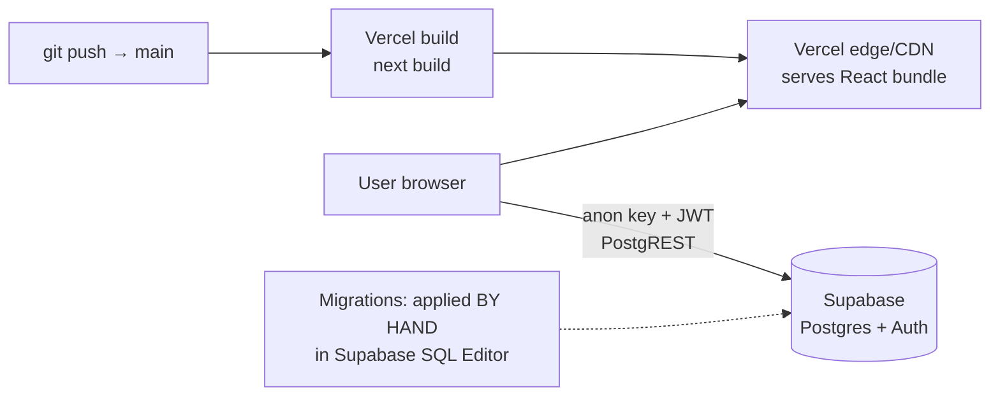
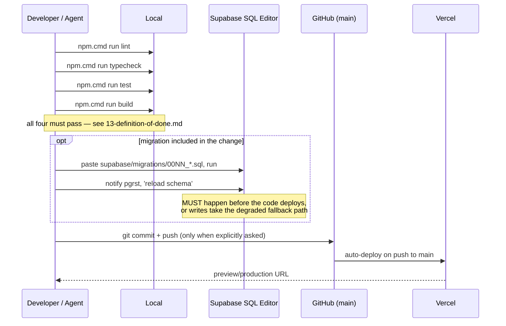

# 11 — Deployment

> **Generated from source code.** Env variables read from `.env.example` and every
> `process.env` reference; deployment behavior from `.vercel/`, `.vercelignore`,
> `next.config.mjs`, and `package.json`.

---

## Purpose

Describe how the application is built, configured, and released — and in particular the
**manual database migration step**, which is the most common cause of production errors.

## Scope

**In scope:** environment variables, build/verify commands, hosting model, release flow,
migration procedure, demo mode, and maintenance scripts.

**Out of scope:** schema content (`05-database.md`), auth internals (`06`).

---

## Current implementation

### Hosting model

Static/SSR frontend on **Vercel**; **Supabase** hosts Postgres and Auth. There is no
application server to deploy, no container, no background worker, and no cron.



`next.config.mjs` is intentionally empty (`const nextConfig = {}`) — no custom webpack,
rewrites, headers, or image domains.

### Environment variables

Only two, both **public by design** (`.env.example`):

```
NEXT_PUBLIC_SUPABASE_URL=
NEXT_PUBLIC_SUPABASE_ANON_KEY=
```

Read once in `lib/supabase.ts`:

```ts
export const isSupabaseConfigured = Boolean(supabaseUrl && supabaseAnonKey);
export const supabase = isSupabaseConfigured ? createClient(url, key) : null;
```

- Local development: `.env.local` (git-ignored).
- Production: set both in Vercel project settings. **There is no service-role key anywhere**,
  and none should be added to a `NEXT_PUBLIC_*` variable — it would be exposed in the bundle.

> ⚠ **Missing env vars silently disable authentication.** `isSupabaseConfigured === false`
> makes `AuthGate` render the whole app with no login (`auth-gate.tsx:11`) and
> `isEmailAllowed` return `true`. Always verify both variables are present in a production
> deployment. See `06-authentication.md`.

### Commands

On Windows use `npm.cmd` — PowerShell execution policy often blocks `npm.ps1`.

| Command | Purpose |
|---|---|
| `npm.cmd install` | install dependencies |
| `npm.cmd run dev` | dev server (`next dev`) |
| `npm.cmd run build` | production build (`next build`) — the release gate |
| `npm.cmd run start` | serve the built app locally |
| `npm.cmd run typecheck` | `tsc --noEmit` |
| `npm.cmd run test` | `vitest run` (95 tests) |
| `npm.cmd run lint` | `next lint` (`eslint.config.mjs`, `next/core-web-vitals`) — currently **0 errors, 0 warnings**; a mandatory gate per `13-definition-of-done.md` |
| `npm.cmd run db:reset` | `node tools/reset-supabase-data.mjs` |
| `npm.cmd run db:seed:master` | `node tools/seed-supabase-master-data.mjs` |

### Release flow



**Ordering rule:** if a change depends on a new column, apply the migration **before** the code
reaches production. Deploying first leaves the app hitting the silent schema-cache fallback
(L-05), which saves records missing fields instead of failing loudly.

### Applying a migration — the manual procedure

1. Open the Supabase dashboard → **SQL Editor**.
2. Paste the contents of the new `supabase/migrations/00NN_*.sql`.
3. Run it.
4. **Run `notify pgrst, 'reload schema';`** as a separate statement. This is mandatory —
   PostgREST caches the schema, and without the reload the app keeps reporting
   *"Could not find the 'x' column of 'y' in the schema cache"* even though the column exists.
5. Reload the app and verify the affected write path.

There is no migration runner, no `supabase` CLI dependency, and no record of which migrations
have been applied to which environment — that state lives only in the database itself.

### `.vercelignore` — what does **not** ship

```
data
docs
.agents
.git
.next
supabase
*.md
```

So documentation, migrations, and the Google Sheets export are excluded from the deployment
bundle. Consequence: **migrations are not available in the deployed artifact**, reinforcing
that they must be applied from the repository by hand.

### Demo / offline mode

With no Supabase env vars the app is fully usable without a backend:

| Aspect | Behavior |
|---|---|
| Auth | bypassed entirely (`auth-gate.tsx:11`) |
| Data source | `lib/demo-data.ts` fixtures + `localStorage` |
| Writes | persist to `localStorage` only; services return the object unchanged |
| `databaseHealth` | fabricated with `usingRealSupabase: false` |

Useful for UI work; **never acceptable as a production configuration.**

### Maintenance scripts (`tools/`)

| Script | Purpose | Caveat |
|---|---|---|
| `reset-supabase-data.mjs` | deletes rows from `audit_logs`, `material_movements`, `price_periods`, `production_orders`, `workers`, `materials` | uses the **anon key**; under RLS with no session it deletes **0 rows and still reports success** |
| `seed-supabase-master-data.mjs` | seeds demo materials/workers | writes the legacy `workers.stage` column and reintroduces `worker_code` values that migration `0018` deliberately cleared, causing conflicts with real workers |

Both are therefore unsafe to rely on as written — see `14-known-limitations.md` (L-19).

### Git conventions

- Work on `main` for this project (deploys are triggered by pushes to `main`).
- **Commits and pushes happen only when explicitly requested** — never automatically. See
  `12-ai-development-workflow.md`.
- `.gitignore` excludes `.env.local`, `.next`, `node_modules`, `.vercel`, `*.log`,
  `tsconfig.tsbuildinfo`, `CLAUDE.local.md`, `*.code-workspace`.

---

## Important rules

1. **Never commit `.env.local`** or any real key. Only `.env.example` is tracked.
2. **Never put a service-role key in a `NEXT_PUBLIC_*` variable** — it ships to the browser.
3. **Always run `notify pgrst, 'reload schema';`** after DDL.
4. **Apply migrations before deploying dependent code.**
5. **Verify both env vars exist in production** — their absence disables authentication.
6. **Run lint + typecheck + test + build before any push.**
7. **Do not commit or push without an explicit instruction.**
8. Migrations are append-only; the next file is `0027_*.sql`.

## Related source code

| File | Role |
|---|---|
| `package.json` | scripts and dependencies |
| `lib/supabase.ts` | env consumption, `isSupabaseConfigured` |
| `components/auth-gate.tsx` | the demo-mode bypass |
| `next.config.mjs` | empty by design |
| `.env.example`, `.gitignore`, `.vercelignore`, `.vercel/project.json` | configuration |
| `tools/reset-supabase-data.mjs`, `tools/seed-supabase-master-data.mjs` | maintenance |

## Related database

The deployed app expects the schema at migration `0026`. Live tables:
`production_orders`, `production_order_items`, `material_movements`, `materials`, `workers`,
`production_stages`, `reference_options`, `app_users`, `audit_logs`, `price_periods`.
At minimum, `app_users` must contain each intended user's email or nobody can log in.

## Known limitations

- **Migrations are entirely manual** with no applied-state tracking; environments can silently
  diverge, and the app degrades quietly rather than failing when they do (L-05).
- Missing env vars turn authentication off instead of failing the deployment.
- **L-19** both maintenance scripts use the anon key and are unreliable/harmful as written.
- No CI pipeline: `lint`/`typecheck`/`test`/`build` are run locally by convention only; nothing
  prevents pushing a broken commit.
- No staging environment defined; `main` deploys straight to production.
- No health check, error tracking (Sentry or equivalent), or uptime monitoring.
- No database backup policy documented; relies on Supabase defaults.
- `.vercelignore` excludes `supabase/`, so the deployed artifact cannot self-report its
  expected schema version.

## Future improvements

1. **Add GitHub Actions CI** running `lint`, `typecheck`, `test`, and `build` on every PR — the
   single highest-value operational improvement.
2. Adopt the Supabase CLI (`supabase migration up`) or add a small runner plus a
   `schema_migrations` table so applied state is knowable.
3. Fail the build when `NEXT_PUBLIC_SUPABASE_*` are missing in a production environment.
4. Rewrite `tools/*.mjs` to require a service-role key from a non-`NEXT_PUBLIC` env var, and
   refuse to run without it.
5. Introduce a staging Supabase project and a Vercel preview environment bound to it.
6. Add error tracking and a `/api/health`-equivalent status surface (or reuse
   `loadDatabaseHealth` on the dashboard).
