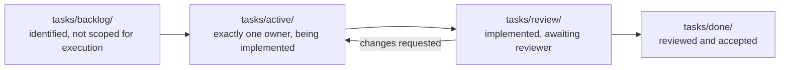
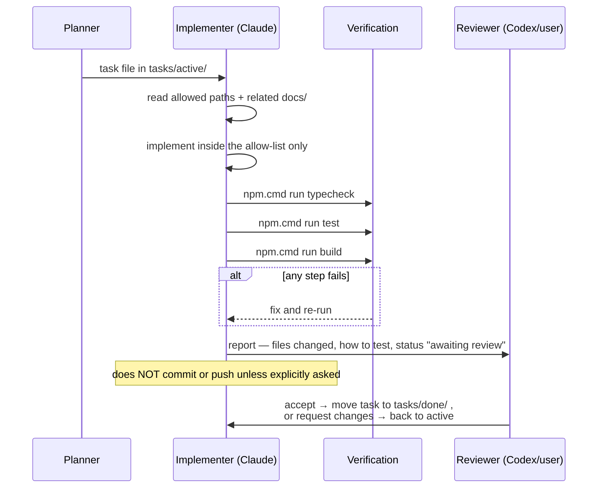

# 12 — AI Development Workflow

> **Generated from the working setup.** Derived from `tasks/**` (the real task files),
> `CLAUDE.md`, and `CLAUDE.local.md`. Only the pipeline that is actually in use is described;
> the abandoned scaffolding is listed under Known limitations so nobody revives it.

---

## Purpose

Define how a unit of work travels from idea to reviewed change when AI agents do the
implementation, and what guarantees each stage provides.

## Scope

**In scope:** roles, the `tasks/` pipeline, task-file format, file-ownership discipline,
verification requirements, git rules, and reporting format.

**Out of scope:** the completion checklist itself (`13-definition-of-done.md`), coding
conventions (`09`).

---

## Current implementation

### Roles

| Role | Actor | Responsibility |
|---|---|---|
| **Planner / architect** | ChatGPT (or the user directly) | defines scope, breaks work into tasks, makes design decisions |
| **Implementer** | Claude Code | writes and edits code strictly within an assigned task's allowed paths |
| **Reviewer** | Codex CLI (or the user) | reviews the change before it is considered complete |

A task has **exactly one implementation owner**. Agents work on separate branches or
worktrees. If two tasks need the same file, the correct action is to **stop and report the
conflict**, not to edit around it.

### The `tasks/` pipeline



Current contents:

| Folder | Contents |
|---|---|
| `tasks/backlog/` | `material-movement.md` — a multi-item technical backlog (REL-*, UX-*, PERF-*, SEC-* items) for the movement module |
| `tasks/active/` | `REL-3-stop-silent-column-fallback.md` |
| `tasks/review/` | (empty) |
| `tasks/done/` | `REL-1-resync-after-delete-failure.md` |

The backlog file holds *identified* work with priority, risk, affected files, description,
and acceptance criteria. When an item is picked up it becomes its own file in `active/`
using the fuller format below.

### Task file format

Fixed section headers, as used by `REL-3`:

```markdown
# Task ID                    → e.g. REL-3
# Title                      → one line, imperative
# Goal                       → the outcome in business/technical terms, 1 paragraph
# Scope                      → precisely what may change, and the approach
# Acceptance Criteria        → checkable statements; behavior that must hold after
# Files allowed to modify    → explicit allow-list
# Files forbidden to modify  → explicit deny-list
# Test plan                  → how the change will be verified
```

`REL-1` (in `done/`) additionally used `# Dependencies` and `# Implementation Notes`. Both
shapes are acceptable; **`Files allowed to modify` / `Files forbidden to modify` are the
critical sections** — they are what makes parallel agent work safe.

Example of the specificity expected (from `REL-1`):

> - Only the `removeOrder()` function in `components/use-material-movements.ts`.
> - Only the failure branch … replace the local re-splice of `target` with a call to
>   `reloadOperationalData()` when `isSupabaseConfigured` is true.
> - Do NOT change: the `isClosedStatus` delete guard, the success path, the audit-log calls,
>   validation logic, or any business rule.
> - Do NOT implement REL-2 or UX-2 — those are separate backlog items and out of scope here.

### Implementation loop



### Verification is mandatory, not optional

Before reporting a task implemented, all three must actually be executed and pass:

```bash
npm.cmd run typecheck     # tsc --noEmit
npm.cmd run test          # vitest run — 95 tests across 5 test files
npm.cmd run build         # next build
```

**Never claim tests passed without running them.** If a step fails, fix the cause; do not
report around it. If a step is skipped, say so explicitly.

### Git rules

1. **Never commit automatically.** Changes are left uncommitted unless the user explicitly
   asks for a commit.
2. **Never push automatically.**
3. **Never merge or deploy** unless explicitly instructed.
4. Do not work directly on `main`/`develop` when a task branch is expected.
5. When committing, review what is staged (`git status` after any broad `git add`) and keep
   unrelated in-progress work out of the commit.
6. Commit messages describe root cause → fix → confirmation of no behavior change, in the
   project's existing style (Vietnamese without diacritics is the norm in history).

### Database changes

Schema changes are the one thing an agent **cannot** complete alone: only the anon key is
available, so DDL cannot be executed. The required handoff is:

1. Write the migration file `supabase/migrations/00NN_description.sql`.
2. Tell the user to run it in the Supabase SQL Editor **plus
   `notify pgrst, 'reload schema';`**.
3. Do not mark the task done until the user confirms the migration ran.

### Reporting format

Every completed change is reported with three sections:

1. **Files changed** — each path with a one-line reason.
2. **How to test** — exact commands, plus what to verify manually in the UI.
3. **Status** — explicitly *awaiting review*, never "done".

### Documentation duty

`docs/` is generated from the implementation, so **behavior changes require a documentation
update in the same task**:

| If you change… | Update… |
|---|---|
| a formula, threshold, or status value | `01-business-rules.md` |
| a layer boundary, hook, or data-flow step | `02-current-architecture.md` |
| a file's responsibility, or add/remove a file | `03-folder-structure.md` |
| a type or relationship | `04-domain-model.md` |
| any migration | `05-database.md` |
| auth or RLS | `06-authentication.md` |
| routing, a view, or a primitive | `07-ui-navigation.md` |
| a service signature or error behavior | `08-api-and-services.md` |
| tests | `10-testing.md` |
| a resolved or newly-found issue | `14-known-limitations.md` |

---

## Important rules

1. **Stay inside the task's allowed paths.** If the fix requires touching a forbidden file,
   stop and report — do not expand scope silently.
2. **One task, one owner.** Report file conflicts instead of resolving them unilaterally.
3. **Run typecheck + test + build, and report honestly.**
4. **Never commit or push without an explicit instruction.**
5. **A task is not done until reviewed.** Present work as "ready for review".
6. **Read before writing:** `docs/14-known-limitations.md` first (so a known issue is not
   re-reported as new), then the docs relevant to the touched layer.
7. **Do not treat legacy documents as authoritative** — everything under `docs/legacy/`
   (moved there from the old `docs/*.md` root files and `docs/ai/**`), plus `.agents/**` and
   `.ai/**`, predates the current implementation and describes an architecture that was
   never built.
8. **Migration tasks require user action**; never assume DDL succeeded.

## Related source code

- `tasks/backlog/material-movement.md` — the standing technical backlog
- `tasks/active/REL-3-stop-silent-column-fallback.md` — current work, and the reference format
- `tasks/done/REL-1-resync-after-delete-failure.md` — a completed example
- `CLAUDE.md` — project-level agent instructions (architecture, conventions, commands)
- `CLAUDE.local.md` — machine-local role definitions and hard rules (not committed)

## Related database

No table backs this workflow — it is filesystem plus git. The only database interaction is the
manual migration handoff described above. `audit_logs` records *application* actions, not
development activity.

## Known limitations

- **No CI enforcement.** The three verification commands are run by convention; nothing
  prevents pushing a commit that fails them (see `11-deployment.md`).
- `tasks/review/` is currently unused in practice — work has moved from `active` to review
  conversationally, then to `done`.
- No task-ID registry: IDs (`REL-*`, `UX-*`) are allocated by hand in the backlog file and
  could collide.
- **Two abandoned agent-instruction systems remain outside `docs/` and still mislead:**
  - `.agents/**` (15 files) — 13 describe a Prisma/NestJS layered backend with controllers,
    use-cases, repositories, and `/api/v1` REST that **does not exist**; `.agents/frontend.md`
    is accurate. The 15th file, `.agents/ai-workflow.md`, is a shorter multi-agent
    collaboration note (roles, branch/worktree discipline, file-ownership conflict handling,
    a completion-report checklist) — it does not describe the Prisma/NestJS architecture and
    is broadly consistent with `CLAUDE.md`'s actual multi-agent workflow section, though it
    predates and is superseded by this document. Not yet archived.
  - `.ai/**` — `architecture.md` and `workflow.md` duplicate each other,
    `prompts/tester.md` is a verbatim copy of `prompts/reviewer.md`,
    `scripts/{dispatch,start,sync}.ps1` are **all 0 bytes**, and `state/status.json` is the
    untouched template `{"currentTask": null, "status": "idle", …}` that nothing reads or writes.
    Not yet deleted.
  - The former `docs/ai/**` (25 files) has already been moved to `docs/legacy/ai/**` — see
    `docs/legacy/README.md` for the per-file migration table.
- A stray `QLKT-K2-AI-Team.code-workspace` file sits in `tasks/backlog/`.
- No definition of who moves a task file between folders, so the pipeline state can drift from
  reality.

## Future improvements

1. **Delete `.ai/`** (dead scripts, dead state file, duplicated prompts) and **archive
   `.agents/`** into `docs/legacy/agents/`, keeping only the content of `.agents/frontend.md`
   (already folded into `02` and `06`) and `.agents/ai-workflow.md` (already folded into this
   document) as still-relevant. (`docs/ai/**` has already been moved to `docs/legacy/ai/**`.)
2. Add GitHub Actions to enforce typecheck + test + build on every PR, making the gate real.
3. Adopt `tasks/review/` properly, or remove it and document the two-stage flow.
4. Maintain a simple `tasks/INDEX.md` with allocated IDs and current owners.
5. Add a `migration required: yes/no` field to the task template so DB handoffs are never missed.
6. Add a "docs updated" line to the task template, mirroring the documentation-duty table.
