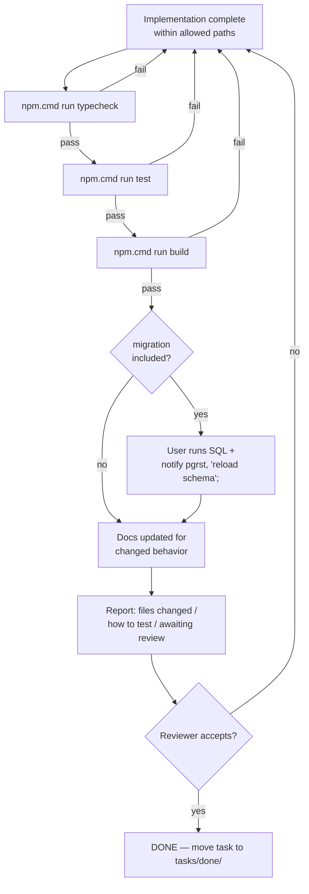

# 13 — Definition of Done

> **Generated from the working setup.** This is the gate as it is actually applied in this
> repository, including the fact that it is enforced by discipline rather than by CI.

---

## Purpose

Give one unambiguous answer to "is this change finished?", so that partial work is never
reported as complete and so that the reviewer knows exactly what has already been verified.

## Scope

**In scope:** the completion checklist for a code change, the extra requirements for schema
and UI changes, the reporting contract, and what explicitly does *not* count as done.

**Out of scope:** how tasks are assigned and moved (`12`), test inventory (`10`).

---

## Current implementation

### The gate



### Mandatory checklist — every change

- [ ] **Scope respected** — only files in the task's *Files allowed to modify* list were touched.
- [ ] **`npm.cmd run typecheck` passes** (`tsc --noEmit`, strict mode, zero errors).
- [ ] **`npm.cmd run test` passes** — all **59** tests green. Output was actually read.
- [ ] **`npm.cmd run build` passes** (`next build` completes with exit code 0).
- [ ] **No new `any`, `@ts-ignore`, or non-null assertion** introduced (current baseline per
      `09-coding-standard.md`: 2 `any`, 3 non-null assertions `!`).
- [ ] **Business logic lives in `lib/`**, not inline in a component or hook.
- [ ] **Layer boundaries intact** — services import no React; pure rule modules import no
      Supabase or services; views call no services directly.
- [ ] **Documentation updated** for any behavior change, per the table in `12-ai-development-workflow.md`.
- [ ] **Reported honestly** — files changed, how to test, and status *awaiting review*.

### Additional — when the change touches `lib/` business logic

- [ ] A **regression test** was added naming the scenario or migration it protects.
- [ ] The existing multi-SKU / item→header-fallback tests still pass **unmodified** — they
      encode hard-won correctness and must not be weakened to make new code fit.
- [ ] No duplicate implementation of an existing rule was introduced (check
      `01-business-rules.md` first; the loss formula already exists in three places).

### Additional — when the change includes a migration

- [ ] The file is `supabase/migrations/00NN_description.sql`, appended (never an edit to an
      applied migration).
- [ ] It is **idempotent** where practical (`add column if not exists`, `create index if not exists`).
- [ ] A **backfill** is included if the new column supersedes a header-level value
      (pattern set by `0024` and `0026`), and the `item.x || header.x` fallback in
      `lib/production-summary.ts` is preserved.
- [ ] **RLS is enabled with a policy** for any new table (following the `0010` whitelist
      pattern) — new tables are unprotected by default.
- [ ] The user has been told to run the SQL **and** `notify pgrst, 'reload schema';`, and has
      **confirmed it ran**. Until then the task is not done.
- [ ] `05-database.md` updated with the new migration row and schema change.

### Additional — when the change touches UI

- [ ] Icon-only buttons have both `title` and `aria-label`.
- [ ] Filter inputs/selects without a visible label have `aria-label`.
- [ ] Loading / empty / error states behave consistently (`isLoadingRemote`, `remoteError`,
      "Chưa có…" empty text).
- [ ] Shared primitives from `components/production-ui.tsx` were used rather than raw
      `<input>`/`<select>`.
- [ ] Copy is terse — no restating the page or drawer title, no explanatory sentence for a
      self-evident control.
- [ ] No blue or green utility colors introduced (the palette overrides `zinc`/`emerald`
      deliberately).
- [ ] Verified visually in the browser at a realistic width, not only reasoned about.

### What does **not** count as done

- ❌ "It compiles" — typecheck alone is not the gate.
- ❌ "Tests should pass" — they must have been **executed** and read.
- ❌ "The migration is written" — it must have been **applied and confirmed**.
- ❌ "It works on my machine" without the build passing.
- ❌ Implementation complete but unreviewed — a change is *ready for review*, not done.
- ❌ Behavior changed but `docs/` left stale.
- ❌ Scope expanded beyond the task's allow-list "because it was necessary" — that is a
      report-and-stop situation.

### Reporting contract

```
1. Files changed      — path + one-line reason for each
2. How to test        — exact commands + what to check manually
3. Status             — awaiting review (never "done")
```

### Commit and deploy are separate, explicit steps

Passing this gate does **not** authorize a commit. Commits and pushes happen only on explicit
instruction; merging and deploying likewise. See `11-deployment.md` and
`12-ai-development-workflow.md`.

---

## Important rules

1. **Run all three commands. Every time.** typecheck → test → build.
2. **Never claim a verification you did not perform**; if something was skipped, say which and why.
3. **A migration is not done until the user confirms it ran** — agents cannot execute DDL
   (anon key only).
4. **Do not weaken a test to make a change pass.**
5. **Update the docs in the same task** as the behavior change.
6. **Stop and report on scope conflicts** rather than widening the change.
7. **Present work as "ready for review".** Review is part of the definition of done.

## Related source code

- `package.json` — the three gate commands (`typecheck`, `test`, `build`)
- `vitest.config.ts` — test runner configuration
- `tsconfig.json` — `strict: true`, the typecheck contract
- `tasks/active/REL-3-stop-silent-column-fallback.md` — a task with explicit acceptance
  criteria and a test plan, i.e. the standard to match
- `lib/production-summary.test.ts` — the multi-SKU/fallback tests that must keep passing

## Related database

Only migration-bearing changes have a database dimension. The gate requires the migration to be
**applied and confirmed** (plus `notify pgrst, 'reload schema';`) before completion, because the
services' silent schema-cache fallback (L-05) means a missing column degrades quietly instead of
failing — so an unapplied migration produces corrupt-looking data rather than an error.

## Known limitations

- **The gate is not enforced by anything.** There is no CI, no pre-commit hook, no branch
  protection — it holds only because agents and reviewers follow it.
- **`npm run lint` is part of no checklist because it cannot run** — no ESLint config exists
  (L-12). Static analysis contributes nothing today.
- **No coverage floor**, so a change can add untested code and still pass.
- **No automated UI verification** — the UI checklist items are all manual, and 0 % of
  components have tests.
- **No schema-conformance check**, so code/schema drift (the trigger for the silent fallback)
  is caught only by a human noticing.
- "Reviewed" is not recorded anywhere durable — it happens in conversation, and
  `tasks/review/` is currently unused.
- No performance or bundle-size budget.

## Future improvements

1. **Add GitHub Actions** running typecheck + test + build on every PR, turning this document
   from convention into enforcement — the highest-leverage change available.
2. Add an ESLint config (plus `eslint-plugin-jsx-a11y`) and add `lint` to the checklist.
3. Add `@vitest/coverage-v8` with a floor on `lib/`, and fail the gate on regression.
4. Add a schema-conformance test asserting every column in `MOVEMENT_SELECT_COLUMNS` exists in
   the migrations.
5. Introduce a PR template mirroring this checklist so review evidence is recorded in git.
6. Record review acceptance by moving the task file to `tasks/done/` in the same commit as the
   change, giving an auditable trail.
