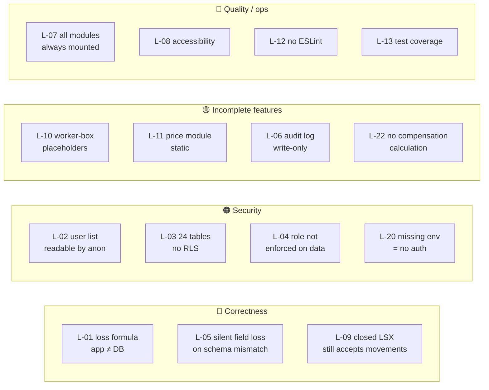

# 14 — Known Limitations

> **Generated from source code.** Every entry was verified in the implementation and carries a
> `file:line` or migration reference. This register is the canonical ID space (`L-01`…`L-22`)
> referenced by the other documents.
>
> **Read this before changing behavior** — so a known issue is not re-reported as a new bug,
> and so a "fix" does not remove a deliberate workaround.

---

## Purpose

Record, with evidence, everything currently known to be wrong, incomplete, or risky — ranked by
severity — and state clearly which items are deliberate trade-offs versus genuine defects.

## Scope

**In scope:** correctness, security, completeness, quality, and operational limitations of the
current implementation.

**Out of scope:** the sequencing and cost of fixing them (`15-future-roadmap.md`).

---

## Current implementation

### Severity summary

---

### 🔴 Correctness

#### L-01 — The application and the database compute `loss` differently
**Severity: high · Deliberate: no · User-visible: yes**

| Layer | Formula |
|---|---|
| App (3 sites) | `max(0, issued − returned − transferred)`, `powder` forced to `0` |
| DB generated column | `greatest(issued_gram − returned_gram − powder_gram, 0)` |
| `README.md:48`, `CLAUDE.md:72-73` | `xuất − nhập − bột` (issued − returned − powder) |

Sites: `components/use-material-movements.ts:112`, `lib/production-mappers.ts:331-343`,
`components/use-production-orders.ts:491`; column at `supabase/migrations/0001_schema.sql:38-40`;
read back at `lib/supabase-mappers.ts:107`.

**Effect:** the app subtracts `transferred`, the database never does. Because the saved row's
generated `loss_gram` is what gets re-displayed, **any movement with `transferred > 0` shows one
loss while editing and a different one after save/reload.** Also, three independent
implementations can drift.

**Do not "fix" one side in isolation** — this needs an accounting decision about whether
`transferred` (chuyển khâu) should reduce loss, then a coordinated change to app + generated
column + docs.

#### L-05 — Silent schema-cache fallback discards business fields
**Severity: high · Deliberate: yes (mechanism) / no (silence)**

`isMissingColumnError` (`lib/material-movements-service.ts:76-77`) matches on the **substring**
`"column"` or `"schema cache"` in the error message, then retries with a reduced 9-field row.

| Site | Line | Degrades to |
|---|---|---|
| `loadProductionOrders` | 200-206 | reduced columns; dates, documents, `item_sku`, sources, converted weights become `""`/`0` |
| `createMaterialMovement` | 338-344 | inserts 9 of ~35 fields — **save reports success** |
| `updateMaterialMovement` | 372-379 | updates 9 fields; existing extended data not preserved |
| `loadProductionOrderItems` | 38 | returns `[]` |
| `replaceProductionOrderItems` | 75, 102 | **items silently not saved** |
| `updateProductionOrderItemStatus` / `…DeliveryStatus` | 126, 149 | silent no-op |

The mechanism exists because migrations are applied by hand and PostgREST caches the schema —
without it, forgetting `notify pgrst, 'reload schema';` breaks the app entirely. The problem is
that it fails **silently and permissively**. Active task:
`tasks/active/REL-3-stop-silent-column-fallback.md`.

#### L-09 — Closing an LSX does not block new movements
**Severity: medium · Deliberate: unclear — the UI contradicts itself**

`isClosedStatus` guards only: delete (`use-material-movements.ts:296`), row-click-to-edit
(`material-journal-view.tsx:285`), the per-row delete button (`material-movement-drawer.tsx:679`),
and close/reopen (`use-selected-production-order.ts:104,166,229`). **There is no guard on the
add path.**

Two UI strings disagree:
- `production-order-detail-drawer.tsx:245-248` — "LSX đã chốt nên đang khóa **thêm**/sửa/xóa giao dịch"
- `material-movement-drawer.tsx:650-653` — "LSX này đã chốt. **Bạn vẫn có thể cập nhật NK NVL** theo luồng xử lý thực tế."

Needs a business decision, then one message and one behavior.

---

### 🟠 Security

#### L-02 — Any anonymous caller can read every user's email, name, and role
`create policy app_users_select_all on app_users for select using (true);` (migration `0009`).
The anon key is public (it ships in the browser bundle), so this is world-readable.

#### L-03 — Roughly 24 tables have no RLS at all
Every table created by migrations `0002` and `0004` — including `sales_orders`, `products`,
`customers`, `loss_settlements`, `material_purchase_transactions`, and all seven
`worker_box_*` tables — has RLS **disabled**, making them readable and writable by anyone with
the public anon key. They are currently unused by the app, so no data flows through them today,
but the exposure is real.

#### L-04 — Role is not enforced on any business data
RLS uses `is_whitelisted_user()` (*"is this email in `app_users`"*) — a binary check. A
`nhan_vien` has full read/write/**delete** on materials, workers, stages, reference options,
production orders, and movements, identical to an `admin`. The only role-aware policy is
`app_users_admin_write`. The five UI role checks
(`material-dashboard.tsx:625,628-632,635-640`; `app-shell.tsx:52,106`) are client-side and
therefore advisory.

#### L-20 — Missing environment variables disable authentication
`isEmailAllowed` returns `true` when Supabase is unconfigured (`lib/auth-service.ts:12-23`) and
`AuthGate` renders the entire app with no login (`components/auth-gate.tsx:11`). Intended as a
demo convenience; in a production deployment a missing env var yields an open application rather
than a failed boot.

#### L-19 — Maintenance scripts use the anon key
`tools/reset-supabase-data.mjs` and `tools/seed-supabase-master-data.mjs` both read
`NEXT_PUBLIC_SUPABASE_ANON_KEY`. Under RLS with no session, the reset script **deletes 0 rows and
still reports success**. The seeder writes the legacy `workers.stage` column and reintroduces
`worker_code` values that migration `0018` deliberately cleared, colliding with real workers.

---

### 🟡 Incomplete features

#### L-10 — Tồn hộp thợ is not a real reconciliation
`lib/worker-box-service.ts:207-314` (`buildWorkerBoxLinesFromMovements`) hard-codes:
- `opening = 0` (`:256`) — **no period carry-forward**, so every period starts from zero
- `physical` set equal to `book`, therefore `diff = 0` always
- `reviewStatus = "matched"` always

So the screen cannot surface a discrepancy, which is the module's entire purpose. It also never
queries Supabase — it computes from movements plus hard-coded fixtures in
`lib/worker-box-data.ts` (which contain stale rows, including an invalid `stageCode: "CK"`).
Meanwhile migration `0004` built seven worker-box tables that are completely unused.

Additionally `filterWorkerBoxLines` (`:102-147`) computes its summary on the **whole period
before** applying the active filters, so the summary ignores the user's filters.

#### L-11 — Giá & định mức is a static placeholder
`components/price-table-view.tsx` (44 lines) renders `lib/demo-data.priceRows`. No persistence,
no CRUD, no reads from `price_periods` (which exists and is RLS-protected but never queried).

#### L-06 — Audit log is write-only from the UI's perspective
`lib/audit-log-service.ts` (12 lines) only inserts. `components/audit-log-view.tsx` renders the
last 20 **in-memory session** events (also mirrored to `localStorage`), so `audit_logs` rows are
never read back. History is invisible after a refresh, and the DB table grows unobserved.
`audit_logs.entity_id` is `not null`, so the sentinel
`00000000-0000-0000-0000-000000000000` is inserted when no entity is supplied
(`audit-log-service.ts:8`).

#### L-22 — No compensation or loss-norm calculation exists
The business purpose includes settling worker compensation for loss above norm. There is **no
implementation**: no norm comparison, no VND amount, no settlement flow. The tables
`loss_norms` and `loss_settlements` exist (migration `0002`) and are unused.

#### L-21 — Dashboard KPIs are demo data
`components/dashboard-overview-view.tsx` consumes `lib/demo-data.kpis` rather than live
aggregates.

---

### 🔵 Quality and operations

#### L-07 — All nine modules stay mounted
Routing toggles `className` between `block` and `hidden` (`material-dashboard.tsx:612-620`
plus each view's root). Every module's `useMemo` chain therefore recomputes on every render
regardless of the active route. **Deliberate** — it is what preserves in-progress form state
across navigation — but it will not scale as data grows.

#### L-08 — Significant accessibility gaps
- `components/production-ui.tsx` — **zero aria attributes across all 10 primitives.**
- `SearchableSelect` is a hand-rolled combobox with no `role="combobox"`, `aria-expanded`,
  `role="listbox"/"option"`, or arrow-key navigation (only Escape) — **keyboard-only users
  cannot select an option.**
- `FieldShell` renders a `` label with no `htmlFor`, so **no field in the app has a
  programmatic label**.
- No drawer or overlay has `role="dialog"`, `aria-modal`, a focus trap, focus restore, or
  Escape-to-close.
- The error toast is not a live region (`app-shell.tsx:56-74`), so errors — including
  validation messages — are not announced.
- Sidebar has no `aria-current`; tables use `<th>` without `scope`.

#### L-12 — No ESLint configuration exists
`package.json` defines `"lint": "next lint"` and installs `eslint-config-next`, but there is
**no `.eslintrc*` or `eslint.config.*` anywhere** in the repository. The documented lint command
has nothing to run, and no automated style or a11y enforcement exists.

#### L-13 — Narrow test coverage
59 tests across **3 of ~45** `lib`/`components` modules. Untested: the loss formula,
`validateMovementDraft`, the whole status machine, all of `production-mappers.ts` (357 lines),
all of `worker-box-service.ts` (328 lines), all 10 services, all 28 components, all 6 hooks. No
coverage threshold, no integration tests, no E2E. Details in `10-testing.md`.

#### L-14 — Six oversized files
`material-movement-drawer.tsx` (962), `material-dashboard.tsx` (884), `worker-box-view.tsx` (682),
`master-data-settings-view.tsx` (569), `use-production-orders.ts` (567),
`material-journal-print-dialog.tsx` (526). `material-dashboard.tsx` additionally retains logic
that belongs elsewhere (`recordStageEntry`, `pushAudit`, `exportJson`, `getDynamicOptions`).

#### L-15 — Dead code and dead schema
- `lib/google-sheet-blueprint.ts` (213 lines) — **zero importers**.
- Unused exports: `PendingJournalRow`, `goldAgeOptions` (which also **conflicts** with
  `movementGoldAgeOptions` on 23K/15K values), `journalMovementReasons`, `sourceOptions`,
  `materialMetalOptions`, `buildWorkerBoxQueryKey`, `normalizeStageForStorage`,
  `convertToPureGoldWeight` (the UI duplicates its arithmetic instead of calling it).
- ~24 dead tables and ~20 dead columns (see `05-database.md`).
- `lib/demo-data.ts` is live but contains stale formats — order codes like `DHAG-26/03/02`
  that `extractOrderCodeMonth` rejects, and stage names such as "Hoàn thiện" with no mapping in
  `normalizeStageCode`.

#### L-16 — Master data is bound by display name
Movements store `worker` as a `full_name` string and `material` as a `name` string; the service
resolves them at save time and **creates the worker if absent** (`upsertWorker`,
`material-movements-service.ts:208-231`). A typo silently creates a new worker; renaming a
worker or material orphans historical rows.

#### L-17 — No concurrency control
No `updated_at` or version column on `material_movements`/`production_orders`, and no conflict
detection. Two users editing the same movement is last-write-wins, silently.

#### L-18 — Data loads once per session
The mount effect has an empty dependency array (`material-dashboard.tsx:187-211`). No polling,
revalidation, or realtime subscription — a second user's changes are invisible until reload.

Other smaller items: duplicated nav label list (`lib/navigation.ts` vs `app-shell.tsx:17-27`);
two LSX form components rendering the same field set; `replaceProductionOrderItems` deletes and
re-inserts so item `id`s are unstable; `remoteError` conflates transport and validation errors;
`worker-box-service.ts` is named `-service` but performs no I/O; no pagination on any loader.

---

## Important rules

1. **Consult this register before reporting a bug** — most surprising behavior is already listed.
2. **L-01, L-05, L-09 need a business decision**, not just a code change. Do not resolve them
   unilaterally.
3. **Do not remove the L-05 fallback outright** — it protects against a forgotten
   `notify pgrst, 'reload schema';`. Make it *loud*, per `REL-3`, rather than deleting it.
4. **L-07 is a deliberate trade-off.** Understand why before "optimizing" it.
5. **When an item is fixed, remove it here** and note the change in `15-future-roadmap.md`.
6. **New limitations get the next free ID** (`L-23`, …) and a `file:line` reference.

## Related source code

`lib/material-movements-service.ts` (L-05, L-16) · `components/use-material-movements.ts` (L-01, L-09) ·
`lib/production-mappers.ts` (L-01) · `lib/worker-box-service.ts` (L-10) ·
`lib/worker-box-data.ts` (L-10, L-15) · `components/price-table-view.tsx` (L-11) ·
`lib/audit-log-service.ts` + `components/audit-log-view.tsx` (L-06) ·
`components/production-ui.tsx` (L-08) · `components/auth-gate.tsx` + `lib/auth-service.ts` (L-20) ·
`lib/google-sheet-blueprint.ts` (L-15) · `tools/*.mjs` (L-19) ·
`components/material-dashboard.tsx` (L-07, L-14, L-18)

## Related database

`supabase/migrations/0001_schema.sql:38-40` (L-01 generated column) ·
`0009` (L-02 `app_users_select_all`) · `0002`, `0004` (L-03 unprotected tables, L-22 unused
`loss_norms`/`loss_settlements`) · `0010`, `0011` (L-04 whitelist-only policies) ·
`0019`/`0020` and `0015`/`0016`/`0017` (revert pairs that make the schema history non-linear).

## Known limitations

Of this document itself: it captures what was found by a full read of the current source, but it
is **not** the output of a security audit, a performance profile, or a load test — none of which
have been performed. Items are ranked by judgement, not measurement. Absence from this list is
not evidence of correctness, particularly in the ~97 % of the codebase with no test coverage.

## Future improvements

Sequencing, effort, and rationale for addressing these items are in `15-future-roadmap.md`.
The three that should be resolved first, in order:

1. **L-01** — reconcile the loss formula (correctness of the system's core number).
2. **L-05 / REL-3** — make schema-mismatch failures loud (silent data loss).
3. **L-02 + L-03** — close the two RLS exposures (single small migration each).
