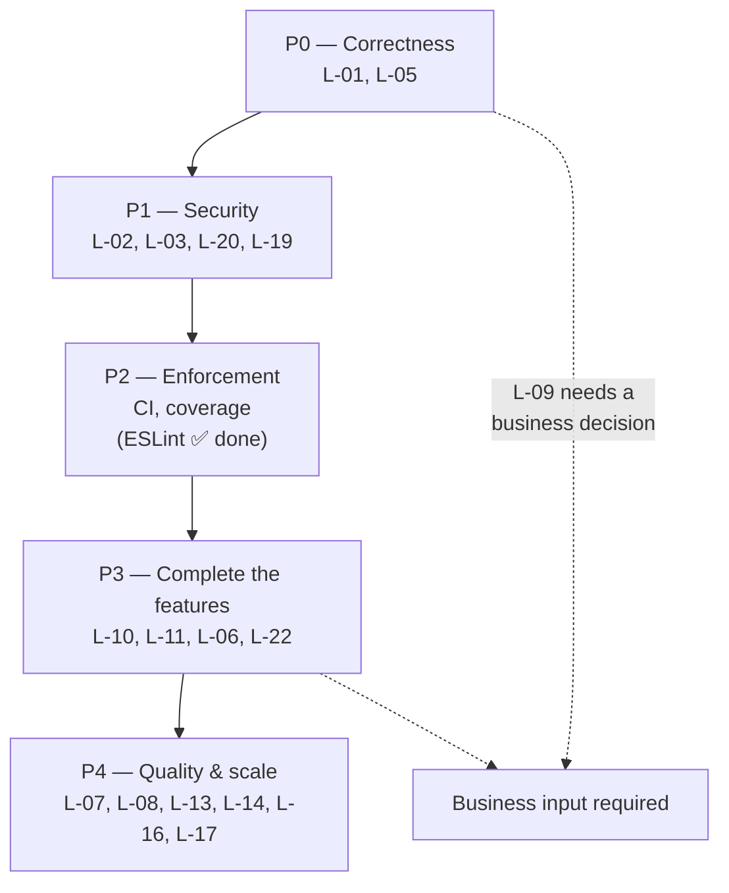

# 15 — Future Roadmap

> **Generated from source code.** Every item traces to a verified finding in
> `14-known-limitations.md` or to a capability the code demonstrably lacks. Nothing here is
> carried over from earlier planning documents.

---

## Purpose

Turn the limitation register into a defensible order of work: what to do next, why that order,
and what each item costs and unblocks.

## Scope

**In scope:** prioritized work items with rationale, dependencies, and rough effort; the
sequencing rationale; explicit non-goals.

**Out of scope:** business requirements not evidenced in the code (any new module beyond what
the current schema and UI imply), and commitments to dates.

---

## Current implementation

### Prioritization principle

Ordered by **risk of silent wrong numbers first**, then **security exposure**, then
**enforcement infrastructure**, then **incomplete features**, then **quality**. Rationale: this
is an accounting-adjacent system where a quietly incorrect loss figure is worse than a missing
feature, and where nothing currently prevents a regression from shipping.



---

### P0 — Correctness (do first)

#### R-1 · Reconcile the loss formula — resolves **L-01**
**Effort: S (code) + business decision · Blocks: R-2, all reporting trust**

1. Decide with the accounting owner whether `transferred` (chuyển khâu) should reduce loss.
2. Extract **one** exported function into `lib/production-business-rules.ts`; have all three
   current sites call it (`use-material-movements.ts:112`,
   `production-mappers.ts:331-343`, `use-production-orders.ts:491`).
3. Align the database: a new migration redefining `material_movements.loss_gram`, or drop the
   generated column and write the value explicitly from the single function.
4. Add unit tests for the formula (currently untested).
5. Correct `README.md:48` and `CLAUDE.md:72-73`, and update `01-business-rules.md`.

#### R-2 · Make schema-mismatch failures loud — resolves **L-05**
**Effort: S · Already scoped as `tasks/active/REL-3-stop-silent-column-fallback.md`**

Classify errors by PostgREST/Postgres **code** (`PGRST204`, `42703`) instead of a substring
match on the message; return whether the fallback path was taken so the UI can warn; keep the
fallback (it protects against a forgotten schema reload) but never let it be silent. Extend the
same treatment to `production-order-items-service.ts`, where items are currently dropped without
a trace.

#### R-3 · Decide and unify closed-LSX behavior — resolves **L-09**
**Effort: XS · Requires business decision**

Either add an `isClosedStatus` guard to the movement add path, or change
`production-order-detail-drawer.tsx:245-248` to stop claiming that adding is blocked. Today the
two drawers state opposite rules.

---

### P1 — Security

#### R-4 · Restrict `app_users` reads — resolves **L-02**
**Effort: XS · One migration**

```sql
drop policy app_users_select_all on app_users;
create policy app_users_self_or_admin on app_users for select
  using (email = auth.jwt() ->> 'email' or is_admin_user());
```
Verify `loadAppUsers()` (admin screen) still works — it runs as an admin, so it should.

#### R-5 · Close the unprotected tables — resolves **L-03**
**Effort: S · One migration**

For the ~24 tables from migrations `0002`/`0004`: either enable RLS with the `0010` whitelist
policy, or **drop them** (they have zero code references). Dropping is cleaner and also
addresses part of L-15 — but keep `loss_norms`, `loss_settlements`,
`inventory_period_balances`, and the `worker_box_*` set if R-11/R-13 will use them.

#### R-6 · Fail closed on missing configuration — resolves **L-20**
**Effort: XS**

Gate the `AuthGate` bypass and `isEmailAllowed`'s permissive return on
`process.env.NODE_ENV !== "production"`, so a production deployment without env vars refuses to
render rather than serving an open app.

#### R-7 · Fix the maintenance scripts — resolves **L-19**
**Effort: XS**

Require a service-role key from a non-`NEXT_PUBLIC` variable; exit non-zero when absent; make
the reset script assert the affected row count instead of reporting success on zero. Stop the
seeder writing the legacy `workers.stage` column and colliding with migration `0018`'s codes.

#### R-8 · Role-aware RLS — addresses **L-04**
**Effort: M · Requires business decision on the permission matrix**

Decide what `nhan_vien` must *not* do (most likely: delete master data, edit
`production_stages`/`reference_options`), then express it in policies. Until then, the five UI
role checks remain advisory only, and this should be stated to users rather than assumed.

---

### P2 — Enforcement infrastructure

#### R-9 · GitHub Actions CI — makes `13-definition-of-done.md` real
**Effort: S · Highest leverage item in the whole list**

Run `lint`, `typecheck`, `test`, and `build` on every PR and on `main`. Today the gate is
convention only; nothing prevents a failing commit from deploying.

#### R-10 · ~~ESLint config~~ **DONE** + coverage floor — **L-12 resolved**, mitigates **L-13**
**Effort: S**

**ESLint part: completed** (task `007`). `eslint.config.mjs` exists — flat config using
`FlatCompat` to extend `next/core-web-vitals` — `npm.cmd run lint` passes with **0 errors and 0
warnings**, and `lint` is now a mandatory gate in `13-definition-of-done.md`. L-12 is resolved
(see `14-known-limitations.md`). Note `eslint-plugin-jsx-a11y` needed no separate install —
`eslint-config-next` already bundles it.

**Still open:** add `@vitest/coverage-v8` with a floor on `lib/`, and consider a lint rule (or a
small script) enforcing the layer import boundaries from `09-coding-standard.md` — the baseline
ruleset does not check them.

#### R-11 · Test the untested core — addresses **L-13**
**Effort: M**

In order of value: the loss formula (via R-1), `validateMovementDraft`, the status machine
(`isClosedStatus`, `getSummaryStatus`), `applyProductionBusinessRules`,
`lib/production-mappers.ts` (357 lines, zero tests), `lib/worker-box-service.ts` (328 lines,
zero tests). Then add jsdom + `@testing-library/react` and cover
`material-movement-drawer.tsx` and `production-order-detail-drawer.tsx`. Add a
schema-conformance test asserting every column in `MOVEMENT_SELECT_COLUMNS` exists in the
migrations — that catches the drift that triggers L-05.

---

### P3 — Complete the half-built features

#### R-12 · Make Tồn hộp thợ a real reconciliation — resolves **L-10**
**Effort: L · The largest genuine functional gap**

Required changes:
1. **Period carry-forward** — replace `opening = 0` (`worker-box-service.ts:256`) with the prior
   period's closing balance.
2. **Physical count entry** — a way to record counted stock, so `diff` and `reviewStatus` become
   meaningful instead of hard-coded `0` / `"matched"`.
3. **Persistence** — the seven `worker_box_*` tables from migration `0004` already exist unused;
   either adopt them or drop them and store balances in a simpler new table.
4. Retire the stale fixtures in `lib/worker-box-data.ts` (which include an invalid
   `stageCode: "CK"`).
5. Fix `filterWorkerBoxLines` so the summary reflects the active filters rather than the whole
   period.

#### R-13 · Loss norms and compensation settlement — resolves **L-22**
**Effort: L · Requires business rules that do not exist in code yet**

This is the system's stated business purpose and is entirely unimplemented. Needs: norm
definitions per stage/material, actual-vs-allowed comparison, a price basis, and a settlement
record. Tables `loss_norms` and `loss_settlements` exist (migration `0002`) as a starting shape.
Depends on R-1 — a compensation figure built on an ambiguous loss number is worse than none.

#### R-14 · Build the price/norm module — resolves **L-11**
**Effort: M**

Replace the 44-line static `price-table-view.tsx` with CRUD against `price_periods` (which
exists and is RLS-protected). Prerequisite for R-13's monetary calculation.

#### R-15 · Read the audit log back — resolves **L-06**
**Effort: S**

Add `loadAuditLogs()` to `lib/audit-log-service.ts` and have `audit-log-view.tsx` render
persisted rows with paging and filters, instead of 20 in-memory session events. Also record
`login`/`logout`/`access_denied` (see `06-authentication.md`).

#### R-16 · Live dashboard KPIs — resolves **L-21**
**Effort: S**

Replace `lib/demo-data.kpis` with aggregates derived from the data already in memory
(`buildProductionOverview` and the loss/worker-box builders already compute most of it).

---

### P4 — Quality and scale

| ID | Item | Resolves | Effort |
|---|---|---|---|
| R-17 | Accessibility pass: proper combobox semantics + keyboard nav in `SearchableSelect`; `role="dialog"` + focus trap + Escape on drawers; real `<label htmlFor>` in `FieldShell`; `aria-current` in nav; `role="alert"` on the toast; `scope` on `<th>` | L-08 | M |
| R-18 | Render only the active module; keep draft state in the existing cache rather than relying on permanently-mounted components | L-07 | M |
| R-19 | Split the six oversized files; move mapper logic out of `use-production-orders.ts` into `lib/production-mappers.ts`; extract `SearchableSelect` to its own file; one component per settings tab | L-14 | M |
| R-20 | Delete `lib/google-sheet-blueprint.ts`; remove unused exports; remove the conflicting `goldAgeOptions`; refresh `lib/demo-data.ts` to current code/stage formats | L-15 | S |
| R-21 | Reference master data by id on movements (keeping denormalized display names for history); stop auto-creating workers on a name typo | L-16 | M |
| R-22 | Add `updated_at` + conflict detection on `material_movements` / `production_orders` | L-17 | S |
| R-23 | Pagination or date-window filtering on `loadProductionOrders`; consider realtime or an explicit refresh instead of load-once | L-18 | M |
| R-24 | **Partly done.** ~~Convert loss `Status` to a union~~ — `LOSS_STATUSES` + derived `LossStatus` shipped, `statusOptions` derived from it (`tasks/backlog/008-low-priority.md`); the `@deprecated Status` alias is **still exported** pending importer migration. **Still open:** (a) rename `ProductionOrder` → `MaterialMovement` and `orders` → `movements`; (b) `StageStatus` / `DeliveryStatus` unions — blocked on `select distinct stage_status`/`delivery_status` against the live database **and** the invalid-UI-value decision (ignore / fallback / block); (c) drop the deprecated `Status` alias | naming traps in `04` | M |
| R-25 | Derive `app-shell` nav from `lib/navigation.ts`; unify the two LSX form components; standardize on one drawer pattern; split the validation channel out of `remoteError` | assorted | S |
| R-26 | ~~Consolidate legacy documentation~~ **Done** — the 16 legacy Vietnamese `docs/*.md` files and `docs/ai/**` (25 files) were reviewed against source, migration-tabled, and moved to `docs/legacy/`; 2 exact/superseded duplicates were deleted. Remaining: delete `.ai/` (dead scripts, dead state, duplicated prompts) and archive `.agents/` the same way | L-15 / doc confusion | S |

---

## Important rules

1. **P0 before anything else.** Do not build reporting or compensation features on top of an
   ambiguous loss number.
2. **R-1, R-3, R-8, R-13 require business input.** Do not decide them in code review.
3. **R-9 (CI) should land early** — it protects every subsequent change and is a few hours' work.
4. **Do not delete the L-05 fallback**; make it loud (R-2).
5. **One roadmap item per task file** in `tasks/`, following the format in
   `12-ai-development-workflow.md`.
6. **When an item ships, remove its limitation from `14-known-limitations.md`** and mark it here.

## Related source code

Primary targets, by item: `lib/production-business-rules.ts` (R-1) ·
`lib/material-movements-service.ts` + `lib/production-order-items-service.ts` (R-2) ·
`components/use-material-movements.ts` (R-3) · `lib/auth-service.ts` +
`components/auth-gate.tsx` (R-6) · `tools/*.mjs` (R-7) · `.github/workflows/` — **does not exist
yet** (R-9) · `eslint.config.mjs` — **exists, R-10's ESLint half is done** ·
`lib/worker-box-service.ts` + `lib/worker-box-data.ts` (R-12) ·
`components/price-table-view.tsx` (R-14) · `lib/audit-log-service.ts` +
`components/audit-log-view.tsx` (R-15) · `components/production-ui.tsx` (R-17)

## Related database

New migrations anticipated (next number is `0027`):

| Item | Migration |
|---|---|
| R-1 | redefine or drop `material_movements.loss_gram` |
| R-4 | replace `app_users_select_all` |
| R-5 | RLS on — or `drop table` for — the ~24 unused tables |
| R-8 | role-aware policies on master-data tables |
| R-12 | adopt or replace the `worker_box_*` tables; add a physical-count column |
| R-13 | activate `loss_norms` and `loss_settlements` |
| R-22 | `updated_at` columns + triggers |

Every one requires the manual apply + `notify pgrst, 'reload schema';` procedure in
`11-deployment.md`.

## Known limitations

- Effort labels (XS/S/M/L) are judgement, not estimates; no measurement has been done.
- The roadmap is derived from **code evidence only** — it cannot capture business priorities
  never expressed in the implementation. In particular, the original Google Sheets export in
  `data/` (13 sheet groups) covers workflows this app does not yet touch: purchase tracking,
  refining batches, order-progress tracking, and price approval. Whether those belong in this
  system is a business decision, not a code finding.
- No performance profiling has been done, so R-18 and R-23 are motivated by structure rather
  than measured slowness.
- Items are not sized against team capacity or sequenced against a calendar.

## Future improvements

For this document: re-derive it after each P0/P1 item ships, and record the shipped items with
their commit so the roadmap doubles as a change log. Once CI (R-9) exists, add a "verified by"
column tying each completed item to the run that proved it.
